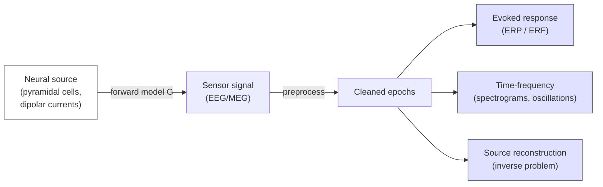

# EEG / MEG analysis

> Electrical and magnetic recordings of neural activity at sub-millisecond resolution. Different physics from MRI, different pipeline, same Bayesian thinking.

EEG and MEG sit alongside MRI / DWI / PET in the modalities table, but their analysis pipeline is sufficiently different that it deserves a dedicated chapter. This page assumes you've read [Fundamentals → Foundations → Medical imaging physics](../fundamentals/foundations/physics.md#eeg-and-meg-biophysics).

## What the data looks like

A raw EEG / MEG recording is a 2D array: **channels × time samples**, at typically 250 Hz – 5 kHz.



## The standard pipeline

1. **Load + montage** — read the vendor file, attach channel positions.
2. **Filter** — high-pass (~0.1 Hz to remove drift), low-pass (~40-100 Hz to remove muscle), notch (50/60 Hz powerline).
3. **Bad-channel detection** — visual or automated (variance, correlation thresholds).
4. **Re-reference** (EEG) — usually average reference or linked mastoids.
5. **Artifact removal** — ICA for blinks / heart / muscle; ASR for amplitude jumps.
6. **Epoching** — cut around event triggers (`-200` ms to `+800` ms for ERPs).
7. **Baseline correction** — subtract pre-stimulus mean per epoch.
8. **Rejection** — drop epochs with residual artifact (autoreject is the modern default).
9. **Average → evoked response** (ERP / ERF) or **time-frequency decomposition** for oscillations.
10. **Source reconstruction** if you have a head model.

## Tools

| Tool | Strength | Docs |
|---|---|---|
| **MNE-Python** | Open source, comprehensive, BIDS-aware | [https://mne.tools](https://mne.tools) |
| **EEGLAB** (MATLAB) | ICA + GUI + plugin ecosystem | [https://eeglab.org](https://eeglab.org) |
| **FieldTrip** (MATLAB) | MEG / EEG / source / connectivity | [https://www.fieldtriptoolbox.org](https://www.fieldtriptoolbox.org) |
| **Brainstorm** (MATLAB) | GUI + integrated source | [https://neuroimage.usc.edu/brainstorm/](https://neuroimage.usc.edu/brainstorm/) |
| **NeuroPype** | Realtime / BCI-flavoured | [https://www.neuropype.io](https://www.neuropype.io) |
| **EEGflow / Auto-EEG** | DL-based automation | research-stage |

For most modern research the answer is **MNE-Python**, with EEGLAB / FieldTrip as alternatives for legacy pipelines.

## A complete MNE-Python ERP recipe

```python
import mne
from mne_bids import BIDSPath, read_raw_bids

# Load a BIDS-EEG dataset
bids_path = BIDSPath(subject="01", task="rest", root="data/bids", datatype="eeg")
raw = read_raw_bids(bids_path)

# Filter
raw.load_data()
raw.filter(l_freq=0.1, h_freq=40.0, fir_design="firwin")
raw.notch_filter(60.0)

# Mark bad channels (manual or automated)
raw.info["bads"] = ["EEG 053"]

# Re-reference
raw.set_eeg_reference("average", projection=True)

# ICA for blink / ECG removal
ica = mne.preprocessing.ICA(n_components=15, random_state=42, max_iter="auto")
ica.fit(raw)
eog_inds, _ = ica.find_bads_eog(raw, ch_name="EEG 001")
ica.exclude = eog_inds
ica.apply(raw)

# Epoch around events
events, event_id = mne.events_from_annotations(raw)
epochs = mne.Epochs(raw, events, event_id={"stimulus": event_id["stim"]},
                    tmin=-0.2, tmax=0.8, baseline=(None, 0),
                    reject=dict(eeg=150e-6), preload=True)

# Drop bad epochs automatically
from autoreject import AutoReject
ar = AutoReject(random_state=42).fit(epochs)
epochs_clean = ar.transform(epochs)

# Compute the evoked response
evoked = epochs_clean.average()
evoked.plot_topomap(times=[0.1, 0.2, 0.3, 0.4], ch_type="eeg")
evoked.save("derivatives/mne/sub-01_task-rest_ave.fif")
```

## Time-frequency analysis

```python
import numpy as np
freqs = np.logspace(np.log10(2), np.log10(40), 25)
n_cycles = freqs / 2.

power = mne.time_frequency.tfr_morlet(epochs_clean, freqs=freqs,
                                       n_cycles=n_cycles, return_itc=False,
                                       average=True, n_jobs=4)
power.plot_topo(baseline=(-0.2, 0.0), mode="logratio", title="Power (log ratio)")
```

For event-related desynchronisation (motor-imagery), short-time Fourier or multitaper around the mu / beta bands.

## Source reconstruction — the inverse problem

You need a **head model** (BEM surfaces from a T1 MRI), a **source space** (cortical mesh from FreeSurfer), and **noise covariance** (from empty-room recording, MEG; or pre-stim, EEG).

```python
import os
subjects_dir = os.environ["SUBJECTS_DIR"]

# Compute boundary-element model from T1 MRI segmentations
model = mne.make_bem_model(subject="sub-01", subjects_dir=subjects_dir)
bem = mne.make_bem_solution(model)

# Source space (8192 vertices per hemi)
src = mne.setup_source_space("sub-01", spacing="oct6", subjects_dir=subjects_dir)

# Forward model
fwd = mne.make_forward_solution(epochs_clean.info, trans="sub-01-trans.fif",
                                 src=src, bem=bem)

# Noise covariance from baseline period
cov = mne.compute_covariance(epochs_clean, tmin=-0.2, tmax=0, method="auto")

# Apply the inverse — MNE / dSPM / sLORETA
inv = mne.minimum_norm.make_inverse_operator(epochs_clean.info, fwd, cov)
stc = mne.minimum_norm.apply_inverse(evoked, inv, lambda2=1./9., method="dSPM")

stc.plot(subject="sub-01", subjects_dir=subjects_dir, hemi="both", time_viewer=True)
```

**dSPM** (dynamic SPM) is the modern default for source localisation; **LCMV beamformers** are preferred for connectivity. See [Hämäläinen et al., 1993](https://doi.org/10.1103/RevModPhys.65.413) for the theory and [Gramfort et al., 2014](https://doi.org/10.1016/j.neuroimage.2013.10.027) for the MNE implementation.

## Group-level statistics

For a sensor-level group analysis: compute per-subject evoked responses, run cluster-based permutation across time × channels:

```python
from mne.stats import permutation_cluster_1samp_test

data = np.stack([np.array(e.data) for e in evokeds])  # (n_subj, n_chan, n_time)
T_obs, clusters, p, _ = permutation_cluster_1samp_test(
    data, n_permutations=5000, threshold=None, tail=0, n_jobs=8,
)
```

For source-level: same machinery operates on `(n_subj, n_vert, n_time)` arrays.

## What can go wrong

- **Eye-movement contamination** — never skip ICA-based ocular rejection.
- **Reference choice changes the topography** — document it explicitly.
- **Forgetting baseline correction** — your evoked map will be dominated by drift.
- **EEG without electrode positions** — you can't do source reconstruction.
- **Single-trial single-channel claims** — almost always non-replicable.

## BIDS for EEG / MEG

BIDS-EEG and BIDS-MEG add their own datatype folders and sidecars. The minimum metadata:

```text
sub-01/
├── eeg/
│   ├── sub-01_task-rest_eeg.edf            # vendor raw
│   ├── sub-01_task-rest_eeg.json           # task, sampling, reference
│   ├── sub-01_task-rest_channels.tsv       # type, units per channel
│   ├── sub-01_task-rest_electrodes.tsv     # 3D positions
│   ├── sub-01_task-rest_coordsystem.json   # coordinate system
│   └── sub-01_task-rest_events.tsv         # onsets + durations + types
```

See [Pernet et al., 2019](https://doi.org/10.1038/s41597-019-0104-8) for the BIDS-EEG paper and [Niso et al., 2018](https://doi.org/10.1038/sdata.2018.110) for BIDS-MEG.

## References

1. **Gramfort A, Luessi M, Larson E, et al.** MEG and EEG data analysis with MNE-Python. *Front Neurosci.* 2013;7:267. [doi:10.3389/fnins.2013.00267](https://doi.org/10.3389/fnins.2013.00267)
2. **Gramfort A, Luessi M, Larson E, et al.** MNE software for processing MEG and EEG data. *NeuroImage.* 2014;86:446-460. [doi:10.1016/j.neuroimage.2013.10.027](https://doi.org/10.1016/j.neuroimage.2013.10.027)
3. **Hämäläinen M, Hari R, Ilmoniemi RJ, Knuutila J, Lounasmaa OV.** Magnetoencephalography — theory, instrumentation, and applications. *Rev Mod Phys.* 1993;65(2):413-497. [doi:10.1103/RevModPhys.65.413](https://doi.org/10.1103/RevModPhys.65.413)
4. **Delorme A, Makeig S.** EEGLAB: an open source toolbox for analysis of single-trial EEG dynamics including ICA. *J Neurosci Methods.* 2004;134(1):9-21. [doi:10.1016/j.jneumeth.2003.10.009](https://doi.org/10.1016/j.jneumeth.2003.10.009)
5. **Oostenveld R, Fries P, Maris E, Schoffelen J-M.** FieldTrip. *Comput Intell Neurosci.* 2011;2011:156869. [doi:10.1155/2011/156869](https://doi.org/10.1155/2011/156869)
6. **Pernet CR, Appelhoff S, Gorgolewski KJ, et al.** EEG-BIDS, an extension to the brain imaging data structure for electroencephalography. *Sci Data.* 2019;6:103. [doi:10.1038/s41597-019-0104-8](https://doi.org/10.1038/s41597-019-0104-8)
7. **Niso G, Gorgolewski KJ, Bock E, et al.** MEG-BIDS, the brain imaging data structure extended to magnetoencephalography. *Sci Data.* 2018;5:180110. [doi:10.1038/sdata.2018.110](https://doi.org/10.1038/sdata.2018.110)
8. **Jas M, Engemann DA, Bekhti Y, Raimondo F, Gramfort A.** Autoreject: automated artifact rejection for MEG and EEG data. *NeuroImage.* 2017;159:417-429. [doi:10.1016/j.neuroimage.2017.06.030](https://doi.org/10.1016/j.neuroimage.2017.06.030)

## Where to next

[Group-level statistics](group-stats.md) and [Multiple comparisons](multiple-comparisons.md) cover the GLM machinery that's identical between modalities once you've collapsed your data to a per-subject summary.
