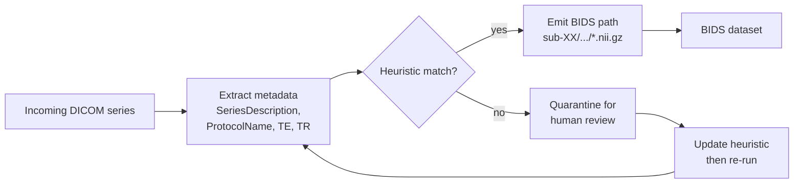

# DICOM to BIDS

> The conversion that takes you from a scanner export to a research-ready dataset.

The scanner gives you DICOM. BIDS apps want NIfTI in a strict layout. Two tools do the conversion, and one heuristics file does most of the work.

## Heuristics — the mental model

Before you reach for any specific converter, internalise the shape of the job. About 80% of DICOM-to-BIDS work is a single pattern: read [DICOM metadata](https://www.dicomstandard.org/) fields off each series — `SeriesDescription`, `ProtocolName`, `EchoTime`, `RepetitionTime`, `ScanOptions`, sometimes `ImageType` — and decide which [BIDS filename](https://bids-specification.readthedocs.io/en/stable/02-common-principles.html#file-name-structure) the series should become, e.g. `sub-XX_ses-YY_task-ZZ_acq-AAA_bold.nii.gz`. Everything else is plumbing.

The decision logic is almost always a tree of `if/elif`:

```python
def infer_bids_name(dicom_metadata):
    desc = dicom_metadata["SeriesDescription"]
    if "MPRAGE" in desc:
        return "anat/sub-{subj}_T1w"
    if "DWI" in desc and "TRACE" not in desc:
        return "dwi/sub-{subj}_dwi"
    if "RESTING" in desc:
        return "func/sub-{subj}_task-rest_bold"
    return None  # let user inspect
```

The three tools in this space each play a different role:

- [`dcm2niix`](https://github.com/rordenlab/dcm2niix) is the raw DICOM → NIfTI engine. It does no BIDS routing; you call it when you want to control the conversion yourself.
- [HeuDiConv](https://heudiconv.readthedocs.io/en/latest/) wraps `dcm2niix` and asks you to write the `if/elif` tree above in a Python heuristics module. Best when the same logic runs across many subjects.
- [Dcm2Bids](https://unfmontreal.github.io/Dcm2Bids/) wraps `dcm2niix` and asks you to write the same tree as JSON match criteria. Best when you prefer declarative config to code.



Common ways the heuristic breaks:

- **Site-to-site drift.** `SeriesDescription` is set by whoever programmed the scanner protocol. The same sequence called `T1_MPRAGE_iso` at site A may arrive as `MPRAGE_PROMO` at site B. Write one heuristic per site, not one heuristic to rule them all.
- **Vendor differences.** Siemens diffusion shows up as `ep2d_diff`; GE as `DWI_dir`; Philips as `DTI`. The same applies to fieldmaps, ASL, and BOLD. Inspect the actual `ProtocolName` values before writing rules.
- **Localisers and calibration scans.** Three-plane localisers, scout runs, ASSET calibrations, and noise scans look like real series but should never enter BIDS. Add an explicit reject branch (`if "LOC" in desc or "SCOUT" in desc: return None`) rather than relying on omission.
- **Repeated runs.** A subject who moves and gets a re-shot T1w produces two MPRAGE series. Decide upfront whether to keep both with `run-01`/`run-02` or take the last; have the heuristic do it deterministically.

The heuristic file is the artefact you version, review, and reuse. The tools below differ mainly in how they want that file written.

## The tools

### `dcm2niix` ([source](https://github.com/rordenlab/dcm2niix)) — the DICOM → NIfTI step

The canonical conversion tool [Li et al., 2016](https://doi.org/10.1016/j.jneumeth.2016.03.001)[^dcm2niix].

You almost never call `dcm2niix` directly when building a BIDS dataset, but every higher-level tool wraps it. The wrapper in this repo lives at `neuro_handbook.dicom.dicom_to_nifti` and is a thin shell around the binary.

```python
from neuro_handbook.dicom import dicom_to_nifti

result = dicom_to_nifti(
    dicom_dir="raw/sub-001/scan_2026_06_15",
    output_dir="staging/sub-001",
    bids_sidecar=True,
)
for nii in result.nifti_files:
    print(nii)
```

### HeuDiConv — opinionated, reproducible ([docs](https://heudiconv.readthedocs.io/en/latest/))

[Halchenko et al., 2024](https://doi.org/10.21105/joss.05839)[^heudiconv].

HeuDiConv takes a folder of DICOMs and a **heuristics file** (Python) describing how to map series to BIDS filenames. Once the heuristics file is written, every new subject converts identically.

```bash
heudiconv -d raw/{subject}/*.dcm -s 001 002 003 \
    -f my_heuristic.py -c dcm2niix -b -o bids/
```

The heuristic looks like:

```python
def create_key(template, outtype=("nii.gz",), annotation_classes=None):
    return template, outtype, annotation_classes

def infotodict(seqinfo):
    t1 = create_key("sub-{subject}/anat/sub-{subject}_T1w")
    dwi = create_key("sub-{subject}/dwi/sub-{subject}_dwi")
    info = {t1: [], dwi: []}
    for s in seqinfo:
        if "MPRAGE" in s.protocol_name:
            info[t1].append(s.series_id)
        elif "DTI" in s.protocol_name and s.dim4 > 1:
            info[dwi].append(s.series_id)
    return info
```

Write the heuristic once, run it on hundreds of subjects.

### Dcm2Bids — opinionated, JSON-config ([docs](https://unfmontreal.github.io/Dcm2Bids/3.2.0/))

Same idea, different config format. You write a JSON describing series matches; the tool produces BIDS.

```json
{
  "descriptions": [
    {"dataType": "anat", "modalityLabel": "T1w",
     "criteria": {"SeriesDescription": "MPRAGE"}},
    {"dataType": "dwi", "modalityLabel": "dwi",
     "criteria": {"SeriesDescription": "DTI_64dir"}}
  ]
}
```

```bash
dcm2bids -d raw/sub-001 -p 001 -c config.json -o bids/
```

## Choosing between them

| If you... | Use |
| --- | --- |
| Convert one site repeatedly, want versioning, write Python comfortably | **HeuDiConv** |
| Convert ad-hoc data, prefer config files | **Dcm2Bids** |
| Need the lowest-level control | `dcm2niix` directly + a custom wrapper |

For multi-site studies, write **one heuristic per site**. Don't try to make one heuristic handle all sites — site-specific quirks dominate.

## What to commit to git

Always commit:

- The heuristics file (or Dcm2Bids config).
- A README describing what scanner / sequence each acquisition is.
- The `dataset_description.json`.

Never commit:

- The raw DICOMs.
- The intermediate NIfTI files. Re-derive them from DICOM + heuristic.
- PHI of any form.

If the conversion is part of a published pipeline, the heuristics file is part of the reproducibility story — pin it like code.

## References

[^dcm2niix]: Li X, Morgan PS, Ashburner J, Smith J, Rorden C. The first step for neuroimaging data analysis: DICOM to NIfTI conversion. *J Neurosci Methods.* 2016;264:47-56. [doi:10.1016/j.jneumeth.2016.03.001](https://doi.org/10.1016/j.jneumeth.2016.03.001)
[^heudiconv]: Halchenko Y, Goncalves M, Velasco PF, et al. HeuDiConv — flexible DICOM converter for organizing brain imaging data into structured directory layouts. *J Open Source Softw.* 2024;9(99):5839. [doi:10.21105/joss.05839](https://doi.org/10.21105/joss.05839)

## Where to next

[Querying with PyBIDS](pybids.md) — once the dataset is BIDS, how do you write pipeline code against it?
