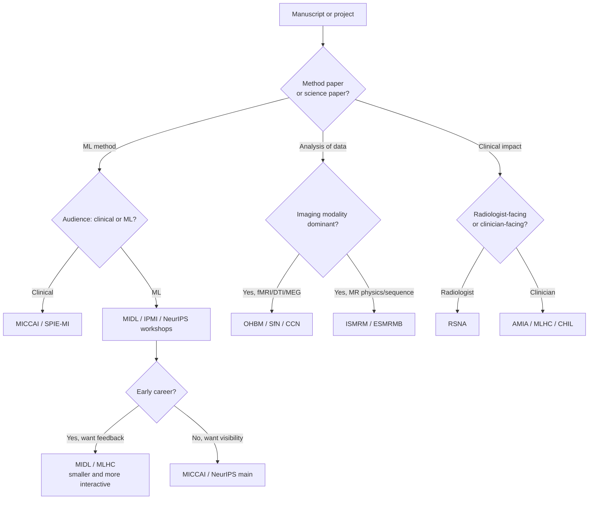

# Conferences, events, and networking

> The annual cadence of the field — which conferences matter, when papers are due, where to network, and how to decide where to submit.

Conferences are where the field's pulse lives — what's hot, who's hiring, where the next collaboration starts. For early-career researchers (students, postdocs, transitioning engineers), the right conference is the single highest-leverage networking move per year.

The handbook's [Career & communication](index.md) section covers what to *write*; this page covers where to *show up*. The [Transitions](transitions.md) page tells you which moves are worth making; this page tells you which rooms to be in when you make them.

Honest framing up-front: many of these conferences cost $500–3000 in registration alone, plus travel and lodging. Virtual / hybrid options exist for most; travel-grant programmes exist for almost all of them. The "Travel grants" section below is the part most trainees skip and then regret.

## Major neuroimaging conferences

These are the venues where the imaging community itself gathers. Pick one to attend each year once you have work to present; pick a different one to attend once *without* work, early on, to learn the landscape.

| Conference | When / where | Audience | Format | Submission deadline | Cost (typical) | Why attend |
| --- | --- | --- | --- | --- | --- | --- |
| **[OHBM](https://www.humanbrainmapping.org)** (Organization for Human Brain Mapping) | Annual, ~June, rotates globally; ~3500 attendees | Cross-modality neuroimaging analytics | Abstract + poster + symposia | ~December | $500–900 trainee / $700–1200 regular | The flagship of the analysis-side field; the single best room for fMRI / DTI / MEG analytics. |
| **[ISMRM](https://www.ismrm.org/annual-meeting/)** (International Society for Magnetic Resonance in Medicine) | Annual, ~May; ~7000 attendees | MR physicists, sequence developers, vendors | Abstract + oral / poster + educational tracks | ~November | $700–1300 | Best for pulse-sequence work, acquisition methods, and scanner-vendor recruiting. |
| **[SfN](https://www.sfn.org/meetings/neuroscience-2024)** (Society for Neuroscience) | Annual, ~November; ~30 000 attendees | Broad neuroscience, mostly basic | Abstract + huge poster floor | ~May | $500–900 | Not imaging-specific but enormous; best for translational neuroscience and pharma adjacency. |
| **[RSNA](https://www.rsna.org)** (Radiological Society of North America) | Annual, ~December, Chicago; ~50 000 attendees | Clinical radiology + industry | Abstract + oral + huge industry floor | ~April | $0–800 (members free) | Best for clinical-imaging AI, device vendors, and seeing what radiologists actually use. |
| **[ESMRMB](https://www.esmrmb.org)** (European Society for MR in Medicine and Biology) | Annual, ~October, Europe | European MR community | Abstract + oral / poster | ~April | €400–800 | The European complement to ISMRM; smaller, friendlier, easier to meet senior figures. |
| **[WMIC](https://wmis.org)** (World Molecular Imaging Congress) | Annual, ~September | Molecular imaging, PET, optical | Abstract + oral / poster | ~April | $700–1100 | Best for PET tracer work and molecular / multimodal imaging. |
| **[CCN](https://2025.ccneuro.org/)** (Cognitive Computational Neuroscience) | Annual, ~August | Comp neuro + ML intersection | Short paper + poster | ~May | $400–700 | The room where comp-neuro people meet ML people — small, intense, fast-moving. |
| **[CNS](https://www.cogneurosociety.org)** (Cognitive Neuroscience Society) | Annual, ~March / April | Cognitive neuroscience, psychology-flavoured | Abstract + symposia | ~November | $400–700 | Best for psychology-adjacent fMRI and behavioural-neuroimaging work. |
| **[OHBM Open Science SIG / Neurolibre events](https://ossig.netlify.app)** | Co-located with OHBM | Open-science practitioners | Sessions + workshops | n/a (apply to organise) | n/a | Where the BIDS / Neurolibre / DataLad crowd is most concentrated in person. |

Rule of thumb: ISMRM is best for *acquisition*, OHBM for *analytics*, RSNA for *clinical translation*, SfN for *systems neuroscience adjacency*.

## Biomedical AI and medical-imaging-ML conferences

These are the venues where imaging AI gets reviewed, published, and recruited from. If you publish a deep-learning method, one of these is almost certainly the right home.

| Conference | When / where | Audience | Format | Submission deadline | Cost (typical) | Why attend |
| --- | --- | --- | --- | --- | --- | --- |
| **[MICCAI](https://miccai.org)** (Medical Image Computing and Computer Assisted Intervention) | Annual, ~October; ~2500 attendees | Medical-imaging ML, mixed clinical + technical | Full paper, ~8 pages, LNCS proceedings; double-blind; ~25–30% accept | ~February–March | $700–1200 | The flagship for medical-imaging AI; the citation-weighted default for method papers. |
| **[MIDL](https://2025.midl.io)** (Medical Imaging with Deep Learning) | Annual, ~July | ML-leaning, less clinical | Full paper + short paper tracks; OpenReview | ~February | $400–700 | Best for early-career method work that wants real ML-audience feedback; more interactive than MICCAI. |
| **[IPMI](https://ipmi.eu)** (Information Processing in Medical Imaging) | Biennial (odd years), ~June; ~150 attendees | Theoretical / methods rigour | Single-track full paper | ~December (even years) | $1000–1500 (includes accommodation) | The prestige venue for theoretical-rigour work; single-track means everyone hears every talk. |
| **[IEEE ISBI](https://biomedicalimaging.org)** (International Symposium on Biomedical Imaging) | Annual, ~April–May | Broader biomedical imaging incl. microscopy | 4-page paper + poster | ~November–December | $600–1000 | Best for cross-modality biomedical imaging and shorter-format publishing. |
| **[SPIE Medical Imaging](https://spie.org/conferences-and-exhibitions/medical-imaging)** | Annual, ~February, San Diego | Clinical + industry-heavy | Abstract → 8-page proceedings | ~August | $700–1200 | Best for clinical-image-processing translation and industry partnerships. |
| **[NeurIPS](https://neurips.cc)** (Neural Information Processing Systems) | Annual, ~December | General ML, dense and large | Full paper + workshop tracks (incl. medical-imaging workshops) | ~May (main); ~August (workshops) | $800–1500 | Best for ML-side visibility; the medical-imaging workshop tracks are the right entry point. |
| **[ICML](https://icml.cc)** (International Conference on Machine Learning) | Annual, ~July | General ML | Full paper + workshops | ~February | $700–1200 | Same role as NeurIPS for the ML community; workshops are the medical entry. |
| **[ICLR](https://iclr.cc)** (International Conference on Learning Representations) | Annual, ~April–May | General ML, representation learning | Full paper, OpenReview, fully open peer review | ~September–October | $700–1100 | Best for representation-learning / foundation-model work; the most transparent review process in ML. |
| **[MLHC](https://www.mlforhc.org)** (Machine Learning for Healthcare) | Annual, ~August | Clinical-AI, mixed clinicians + ML researchers | Full paper, PMLR proceedings | ~April | $500–900 | Best for clinically-grounded ML — papers must include clinical context. |
| **[AMIA Annual Symposium](https://amia.org/education-events)** (American Medical Informatics Association) | Annual, ~November | Clinical informatics, EHR, NLP | Full paper + posters | ~March | $700–1200 | Best for EHR / clinical NLP / informatics intersections — less imaging-pure but adjacent. |
| **[HIMSS](https://www.himss.org)** | Annual, ~March, US | Healthcare IT, industry-dominated | Vendor showcase + sessions | ~April (year before) | $1000–2500 | Best for understanding the *business* of clinical IT — not a research conference. |
| **[CHIL](https://chilconference.org)** (Conference on Health, Inference, and Learning) | Annual, ~April | Newer ML-health venue | Full paper, PMLR | ~December | $400–700 | Best for early-career ML-health work; smaller and friendlier than MLHC. |

Rule of thumb: MICCAI is the flagship; MIDL is the place for honest method feedback; IPMI is the prestige venue when the maths is the point; the NeurIPS / ICML / ICLR workshops are where you get ML-community readership without competing for a main-track slot.

## Workshops, hackathons, and short events

Hackathons and workshops are, hour-for-hour, the cheapest career investment a trainee makes. They produce a public artefact, a working network, and a credible CV line in 2–5 days.

- **[Brainhack Global / regional events](https://brainhack.org)** — year-round, distributed, hands-on, project-based. The model of the open-neuroscience hackathon. See [Gau et al., *Neuron* 2021](https://doi.org/10.1016/j.neuron.2021.04.001) for the origin and philosophy.
- **[OHBM Brainhack](https://github.com/ohbm/hackathon-events)** — 2–3 days immediately before OHBM main meeting. Free or low-cost if you're already attending OHBM.
- **[MICCAI Educational Challenges and Tutorials](https://miccai.org)** — pre-conference workshops, several with scholarships covering registration.
- **[MICCAI Brain Lesion Workshop (BrainLes)](https://www.brainlesion-workshop.org)** — annual MICCAI satellite for tumour / stroke / MS segmentation work.
- **[MICCAI Computational Diffusion MRI (CDMRI)](http://cmic.cs.ucl.ac.uk/cdmri/)** — annual MICCAI satellite; the canonical workshop for diffusion-MRI methods.
- **[ASNR-MICCAI BraTS Challenge](https://www.synapse.org/brats)** — the long-running Brain Tumor Segmentation challenge, run annually at MICCAI.
- **[BIDS workshops and tutorials](https://bids.neuroimaging.io/community/events.html)** — co-located with OHBM and ISMRM; the canonical entry point for BIDS-app authoring.
- **[MONAI Bootcamp](https://monai.io/bootcamp.html)** — free, hands-on PyTorch + medical-imaging training; run by the MONAI core team.
- **[MNE-Python workshops](https://mne.tools/stable/install/learn_python.html)** — annual at OHBM and as standalone events; the right entry for M/EEG analysis.
- **[Neurohackweek and ReproNim training events](https://www.repronim.org/teachable.html)** — short ReproNim courses on reproducible neuroimaging computation.

For someone preparing any of the career transitions in [Transitions](transitions.md), one hackathon per year early in training pays back faster than any other single investment.

## Summer schools and intensive courses

Longer-format intensives are the right call when you want depth, structured curriculum, and a cohort. Most are competitive; apply early (often 4–6 months ahead).

- **[Neurohackademy](https://neurohackademy.org)** (University of Washington) — 2-week intensive in August, ~70 trainees, project-based. The canonical entry for early-career open-science neuroimaging. ~$3500 + travel; need-based scholarships available.
- **[OHBM Educational Course](https://www.humanbrainmapping.org)** — the day before OHBM main meeting; covers foundational analytics topics. Cheapest way to get up to speed if you're already attending OHBM.
- **[Neuromatch Academy](https://academy.neuromatch.io)** — 3-week summer course in computational neuroscience and deep learning, fully online and free; competitive admissions but huge cohort.
- **[Methods in Neuroscience at Dartmouth (MIND)](https://mindsummerschool.org)** — annual summer course focused on advanced analysis methods.
- **[Lipari Summer School in Computational Neuroscience](https://lipari.cs.unict.it)** — ~1 week in Italy; advanced neuro + ML.
- **[Marseille Brain School](https://brainschool.univ-amu.fr)** — annual European school covering neural data analysis.
- **[Mitacs Globalink Research Award](https://www.mitacs.ca/our-programs/globalink-research-award/)** — short research-exchange grants (12–24 weeks) for international trainees.
- **[Kavli Foundation Summer Programs](https://www.kavlifoundation.org)** — competitive, well-funded, multiple institutes (CSHL, MBL, Janelia).
- **[Cold Spring Harbor Laboratory courses](https://meetings.cshl.edu/courseshome.aspx)** — intensive lab-based courses; the **Computational Neuroscience: Vision** and **Imaging Structure and Function in the Nervous System** courses are particularly relevant.
- **[CCN Tutorial Series](https://2025.ccneuro.org/)** — at the CCN conference; comp-neuro + ML deep dives.

Stack one summer school early (it teaches you the field) and one hackathon per year (it grows the network and the artefacts).

## Networking channels — the year-round equivalent

Conferences happen annually; the real network lives in chat. The channels below are where to ask questions, follow announcements, and keep loose ties warm between events.

- **[NeuroStars](https://neurostars.org)** — Q&A forum, ~30 k users; the canonical place to ask methods questions about fMRIPrep, QSIPrep, FreeSurfer, BIDS, and most major tools. Maintainers monitor actively.
- **[BIDS community channels](https://bids.neuroimaging.io/community/communication.html)** — Slack and Google Group; the canonical home for BIDS-spec discussion and BIDS-app authoring help.
- **[MONAI Slack](https://forms.gle/QTxJq3hFictp31V8A)** — DL-for-medical-imaging community; the right place for MONAI-specific debugging.
- **[MICCAI Slack and Society membership](https://miccai.org/index.php/membership/)** — annual MICCAI community and student / member networking.
- **[Bluesky / Mastodon neuroscience tags](https://bsky.app/search?q=neuroimaging)** — `#neuroscience #fmri #neuroimaging #medicalAI` are increasingly active on Bluesky; the academic Mastodon presence has stabilised on `fediscience.org` and `mas.to`.
- **NeurIPS / MIDL workshop Slacks** — workshop-affiliated, year-round between events; check the workshop website for invite links.
- **[OHBM mailing list and newsletter](https://www.humanbrainmapping.org)** — moderate-volume announcements; the right list to follow for travel-award and elections news.
- **[MNE-Python Discourse](https://mne.discourse.group/)** — the active forum for M/EEG analysis questions.
- **[FreeSurfer mailing list](https://surfer.nmr.mgh.harvard.edu/fswiki/FreeSurferSupport)** — long-running, archive-searchable; almost every FreeSurfer issue has been answered there before.
- **GitHub Discussions on tool repos** ([fMRIPrep](https://github.com/nipreps/fmriprep/discussions), [MRtrix3](https://community.mrtrix.org), [MONAI](https://github.com/Project-MONAI/MONAI/discussions), [Nilearn](https://github.com/nilearn/nilearn/discussions)) — the fastest path to reach maintainers when the issue is code-level.

For the broader consortia and standards bodies (ENIGMA, ReproNim, INCF, CONP, the OHBM Open Science SIG), see the [Communities & consortia](../further-reading.md#communities-consortia) table on the Further reading page. For tool catalogues that overlap with networking (NITRC, MR-Hub, NeuroBagel), see [Tools landscape → Further catalogues](../tools/index.md).

## Submission timelines — the annual calendar

Plan a year by deadline, not by conference date. The lead time between submission and conference matters: it determines which work you can credibly target.

| Submission month | Conferences due | Conference month |
| --- | --- | --- |
| **September–October** | ICLR (full papers) | ~April–May |
| **November** | ISMRM (abstracts); IPMI (papers, odd years); NeurIPS (mostly closed by then, reviewer responses) | May; June; December |
| **December** | OHBM (abstracts); CHIL (papers); IPMI (papers) | June; April; June |
| **January–February** | MICCAI (papers); MIDL (papers); ICML (papers); SPIE-MI (deadlines for some categories) | October; July; July; February (year-out) |
| **March–April** | ISBI (papers — variable); RSNA (abstracts); AMIA (papers) | April–May; December; November |
| **May** | MLHC (papers); NeurIPS (papers); SfN (abstracts) | August; December; November |
| **July–August** | SPIE-MI (abstracts for next-Feb meeting); NeurIPS workshop papers | February (next year); December |

Pre-print strategy: post to [bioRxiv](https://www.biorxiv.org) or [arXiv](https://arxiv.org) ~2 weeks before the conference deadline regardless of the venue's policy. It protects priority, costs nothing, and is permitted by every conference listed above. See [Methods writing](methods-writing.md) for what to put in the methods section *before* posting.

## Choosing where to submit — venue-fit decision flow

Most fMRI / DTI analysis work lives at OHBM, not MICCAI. Most segmentation / detection / generative model work lives at MICCAI, not OHBM. Going to the wrong audience wastes a year of work. The flow below is the first-pass filter.

A second filter: if you are early-career and looking for *feedback*, smaller and more interactive venues (MIDL, MLHC, CHIL, IPMI, Brainhack) usually serve you better than the big rooms. If you are senior and looking for *visibility*, the flagships (MICCAI, OHBM, NeurIPS, RSNA) earn their cost.

## Travel grants and early-career funding

Most trainees miss out on travel funding by not asking. The order of operations: ask your PI first; if the lab budget is no, then apply for grants below.

| Programme | Who's eligible | Amount | Deadline |
| --- | --- | --- | --- |
| **[OHBM Trainee Travel Award](https://www.humanbrainmapping.org/i4a/pages/index.cfm?pageid=3937)** | Students, postdocs with accepted abstract | ~$1000 | ~February |
| **[ISMRM Junior Fellow / Educational Stipends](https://www.ismrm.org/awards/)** | Postdocs and students with accepted abstracts | ~$500–1500 | ~December |
| **[MICCAI Student Volunteer Program](https://miccai.org)** | Students | Free registration in exchange for ~20 hours volunteering | ~June |
| **[MICCAI Educational Challenge](https://miccai-edu.github.io/)** | Students | $200–1000 + named mentor pairing | ~July |
| **[NIH F-series fellowships (F30 / F31 / F32)](https://researchtraining.nih.gov/programs/fellowships)** | US PhD / postdoc trainees | Stipend + training budget that covers conference travel | Multiple deadlines / year — see [Grant writing](grant-writing.md) |
| **[Brainhack travel and inclusion grants](https://brainhack.org)** | Open, need-based | ~$200–500 | Per-event |
| **[Neuromatch Academy](https://academy.neuromatch.io)** | Open application | Free + stipend in some cohorts | ~March |
| **[NIH R13 conference-support grants](https://grants.nih.gov/grants/guide/pa-files/PA-21-151.html)** | Organisers, not individuals | Funds student travel at supported meetings | Rolling |
| **[Wellcome / MRC training travel](https://wellcome.org/grant-funding)** | UK trainees | Variable | Rolling for some, annual for others |
| **[NSF GRFP supplemental funding](https://www.nsfgrfp.org)** | NSF GRFP holders | Travel + research costs | Annual |

If you are an NIH F-series or K-series awardee, your training budget already includes conference travel — use it; that's what it's for.

## The post-conference work

The conference is the easy part. The follow-through is where the value compounds.

- **Within 48 hours.** Write follow-up emails to anyone you genuinely connected with — 3–5 lines, reference one specific conversation, suggest one specific next step (a paper to share, a question to follow up on, a 30-minute call).
- **Within 1 week.** Turn the best ideas from the conference into a 1-page summary for your lab meeting. Force yourself to name the three best talks and why.
- **Within 1 month.** Take one action item from the conference and complete it. Usually: a paper to read end-to-end, a tool to try on your own data, a collaboration to formally propose.
- **Within 3 months.** Decide whether the trip earned its cost. If yes, return next year; if no, switch venues for next year and document why for your own future reference.

For turning the trip into a paper, see [Methods writing](methods-writing.md). For turning the network into a job move, see [Transitions](transitions.md).

## References

1. **Gau R, Noble S, Heuer K, et al.** Brainhack: developing a culture of open, inclusive, community-driven neuroscience. *Neuron.* 2021;109(11):1769–1775. [doi:10.1016/j.neuron.2021.04.001](https://doi.org/10.1016/j.neuron.2021.04.001)
2. **Markiewicz CJ, Gorgolewski KJ, Feingold F, et al.** The OpenNeuro resource for sharing of neuroscience data. *eLife.* 2021;10:e71774. [doi:10.7554/eLife.71774](https://doi.org/10.7554/eLife.71774)
3. **Poldrack RA, Gorgolewski KJ, Varoquaux G.** Computational and informatic advances for reproducible data analysis in neuroimaging. *Annu Rev Biomed Data Sci.* 2019;2:119–138. [doi:10.1146/annurev-biodatasci-072018-021237](https://doi.org/10.1146/annurev-biodatasci-072018-021237)
4. **OHBM official site** — [https://www.humanbrainmapping.org](https://www.humanbrainmapping.org)
5. **MICCAI Society** — [https://miccai.org](https://miccai.org)
6. **ISMRM** — [https://www.ismrm.org](https://www.ismrm.org)
7. **Brainhack network** — [https://brainhack.org](https://brainhack.org)
8. **Neurohackademy** — [https://neurohackademy.org](https://neurohackademy.org)
9. **Neuromatch Academy** — [https://academy.neuromatch.io](https://academy.neuromatch.io)

## Where to next

- [Career & communication index](index.md) — the section landing.
- [Transitions — academia ↔ industry](transitions.md) — what each move actually involves; the network you build here feeds those decisions.
- [Grant writing](grant-writing.md) — the F / K / R machinery that funds conference travel.
- [Methods writing](methods-writing.md) — turning the conference trip into a publishable artefact.
- [Further reading → Communities & consortia](../further-reading.md#communities-consortia) — ENIGMA, ReproNim, INCF, CONP and the standards bodies that organise much of the year-round community work.
- [Tools landscape → Further catalogues](../tools/index.md) — NITRC, MR-Hub, NeuroBagel and the tool-discovery infrastructure that the conferences feed.
