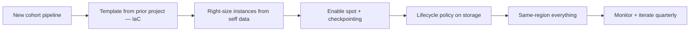

# FinOps and cost engineering

> The five FinOps levers; showbacks vs chargebacks; cost of a 1000-subject DK rerun.

## The five FinOps levers

| Lever | Controls |
|---|---|
| **Right-sizing** | Instance type vs actual usage |
| **Spot / preemptible** | Trade availability for ~70% cut |
| **Reserved / committed** | Pre-commit for ~30–50% off |
| **Storage tiering** | Cold data to Glacier / Archive |
| **Data egress** | Keep compute near data |

[FinOps Foundation framework](https://www.finops.org/framework/) is the public reference.

## Showbacks vs chargebacks

- **Showback** — bill is shown per team but paid centrally.
- **Chargeback** — each team is billed and accountable.

Most orgs start with showback; move to chargeback when leadership wants accountability.

## Worked example — cost of a 1000-subject DK rerun

| Substrate | Per-subject | Cohort cost | Notes |
|---|---|---|---|
| HPC, included | "free" | "free" | Pre-paid; not really free |
| AWS Batch on-demand `c6i.4xlarge` | ~$2.40 (3 h) | ~$2,400 | Predictable |
| AWS Batch spot `c6i.4xlarge` | ~$0.72 (3 h) | ~$720 | Possible preemption |
| AWS Batch + FastSurfer GPU | ~$0.50 (10 min `g5.xlarge`) | ~$500 | Algorithm choice beats infra |

Cost is dominated by algorithm (`recon-all` vs FastSurfer), then by spot vs on-demand.

## Worked case study — DWI cohort N=1000 on AWS

A real budget, line by line, so the abstractions above land. Numbers are list-price as of 2026; check the live [AWS pricing](https://aws.amazon.com/pricing/) page before you build a spreadsheet around them.

### Scenario

- **Cohort:** 1000 subjects, diffusion-only study.
- **Raw data:** DICOMs at ~2 GB / subject → **2 TB raw**.
- **Derivatives:** preprocessed BIDS at ~500 MB / subject → **500 GB derivatives**.
- **Connectome:** 50 MB / subject → **50 GB**.
- **Pipeline:** QSIPrep (~8 CPU·h) + MRtrix tractography (~6 CPU·h) + connectome construction (~1 CPU·h) = **~15 CPU·h / subject**, **15 000 CPU·h total**.
- **Compute substrate:** AWS Batch on `c5.4xlarge` (16 vCPU, $0.68/h on-demand, ~$0.20/h spot).
- **Storage substrate:** S3 with lifecycle policy.

### 1. Storage — year-1 breakdown

| Bucket | Tier | Size | $/GB·month | Annual cost |
|---|---|---|---|---|
| Raw DICOMs, active | S3 Standard | 2 TB | $0.023 | **$552** |
| Derivatives | S3 Standard | 500 GB | $0.023 | **$138** |
| Connectomes | S3 Standard | 50 GB | $0.023 | **$14** |
| **Year-1 total** | | 2.55 TB | | **$704** |

After year 1, lifecycle the raw to colder tiers:

| Year 2+ tier | Annual cost | Cumulative savings vs Standard |
|---|---|---|
| S3 IA (2 TB raw) | $288 | $264 / yr |
| Glacier Flexible (2 TB raw) | $86 | $466 / yr |
| Glacier Deep Archive (2 TB raw) | $24 | $528 / yr |

Picking Deep Archive for raw at year 2 and keeping the 500 GB of derivatives on Standard: year-2 storage drops from $704 to **$176 / yr**, a 75% cut.

### 2. Compute — three substrates

$$
\text{cost} = \frac{\text{CPU·h}}{\text{vCPU per instance}} \times \text{instance } / h
$$

| Substrate | $/CPU·h | Total compute |
|---|---|---|
| `c5.4xlarge` on-demand | $0.68 / 16 = **$0.0425** | 15 000 × $0.0425 = **$638** |
| `c5.4xlarge` spot (~30% of OD) | **$0.0125** | 15 000 × $0.0125 = **$188** |
| `c5.4xlarge` spot (~70% of OD, conservative) | **$0.0298** | 15 000 × $0.0298 = **$447** |
| HPC Slurm, amortised | **$0.005** | 15 000 × $0.005 = **$75** |

Spot vs on-demand (using the conservative 70% multiplier): **$191 saved**, **30% cut**. Use the realistic spot price for your region — AWS publishes [spot-price history](https://docs.aws.amazon.com/AWSEC2/latest/UserGuide/using-spot-instances-history.html).

### 3. Egress

Two egress patterns to budget for:

- **One-off collaborator pull**, 200 GB out of region: $200 × 0.09 = **$18**.
- **Monthly results push** to a UK-based collaborator, 50 GB/month: 50 × 0.09 × 12 = **$54 / yr**.

If you keep collaborator compute inside the same AWS region (sharing a bucket with read access): **$0**. This is the single most-effective egress mitigation.

### 4. Dev / ops

This is the line most newcomers miss — and it dominates.

- **Initial setup:** 50 engineer-hours × $100/h = **$5 000**.
- **Maintenance:** 10 hours/month × $100/h × 12 = **$12 000 / yr**.

Total dev/ops year 1: **$17 000**.

### 5. Year-1 total budget

| Line | Year-1 cost | Share of total |
|---|---|---|
| Storage | $704 | 4% |
| Compute (spot) | $447 | 2% |
| Egress | $54 | 0.3% |
| **AWS infrastructure subtotal** | **$1 205** | **6%** |
| Dev/ops | $17 000 | 94% |
| **Year-1 total** | **$18 205** | **100%** |

**Punchline.** AWS infrastructure is **6% of the bill**. Optimise *dev time first*, *infrastructure cost second*. A FinOps program that saves 30% on EC2 saves $134/yr. A templating effort that cuts maintenance from 10 to 5 hours/month saves $6 000/yr — *50× the gain*.

### 6. Optimisation levers — estimated saving

| Lever | Estimated saving | Touches |
|---|---|---|
| Spot vs on-demand | ~30% compute | Compute line |
| Right-sizing instance | 20-40% compute | Compute line |
| Tier rotation (Standard → IA → Glacier) | 50-80% storage on cold data | Year 2+ storage |
| Same-region compute + storage | Eliminates intra-pipeline egress | Egress line |
| Lifecycle policies day one | Prevents bill drift | Storage line |
| **Templating / IaC** | **50% reduction in dev time after initial setup** | **Dev/ops line — biggest lever** |
| Reserved instances (3-yr) | 30-50% compute (if steady-state) | Compute line |

### 7. Optimisation order of operations

The order matters: templating compounds across every future project; spot only saves on this one; lifecycle only matters once data is cold. Do them in that sequence and the curve bends down across years, not just months.

### 8. The SLO trade-off

Cheaper architectures shift cost onto the on-call rotation. Spot interruption means jobs retry; tier rotation means restore latency; same-region pinning means a region outage takes everything out. Every lever above has an SLO consequence; cross-check against [Reliability and operations](../reliability.md) before committing to a target — a 30% compute cut that doubles your incident rate is a bad trade.

## Tools

- **AWS Cost Explorer / GCP Billing / Azure Cost Management** — first-party.
- **Vantage / CloudZero / Datadog Cost** — third-party, multi-cloud.
- **Kubecost / OpenCost** — Kubernetes-native.

## References

1. **Storment JR, Fuller M.** *Cloud FinOps.* 2nd ed. O'Reilly; 2023. ISBN 978-1492054634.
2. **FinOps Foundation Framework.** [https://www.finops.org/framework/](https://www.finops.org/framework/)

## Where to next

[Performance — queues, percentiles, skew](performance.md).
