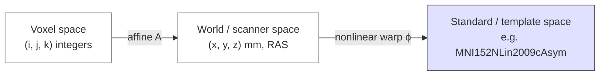
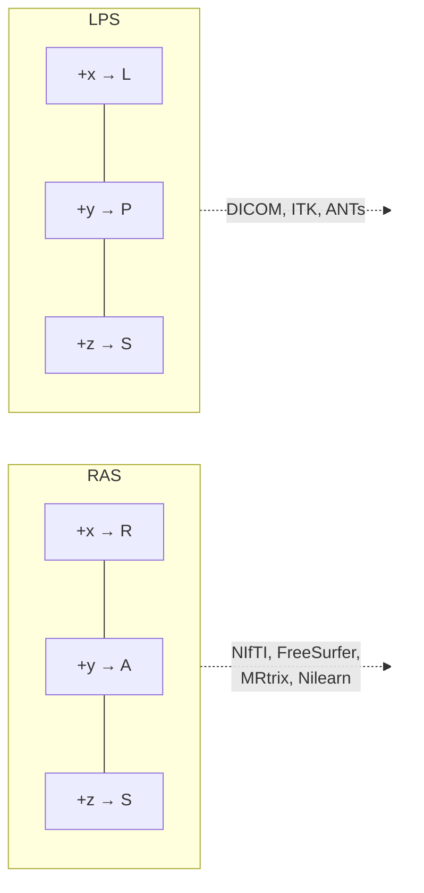

# Coordinate systems

> How voxel indices, scanner space, and standard templates relate — and where most "the masks don't line up" bugs come from.

Three spaces matter:



*<small>The three coordinate frames of a neuroimaging volume and the maps between them. Original figure.</small>*

1. **Voxel space** — the integer indices into the data array, `(i, j, k)`.
2. **World / scanner space** — millimetres relative to a fixed origin (often the scanner isocentre).
3. **Standard / template space** — millimetres in a published atlas (MNI152, fsaverage, fsLR).

The mapping between them is a 4×4 affine matrix, stored in the NIfTI header.

## The affine

```text
[x_mm]   [m00 m01 m02 m03] [i]
[y_mm] = [m10 m11 m12 m13] [j]
[z_mm]   [m20 m21 m22 m23] [k]
[  1 ]   [ 0   0   0   1 ] [1]
```

The top-left 3×3 encodes rotation, scaling, and (when present) shear. The right column encodes translation. Voxel `(0, 0, 0)` does **not** sit at world `(0, 0, 0)`; it sits at the translation column. Most bugs come from forgetting the affine entirely and just sampling by index.

## RAS vs LPS

Two opposite conventions for what positive `x`, `y`, `z` mean:



*<small>The two axis conventions, and which ecosystems use each. Original figure.</small>*

- **RAS** — positive axes point toward the subject's **R**ight, **A**nterior, **S**uperior. Used by NIfTI, FreeSurfer, MRtrix, Nilearn.
- **LPS** — positive axes point toward the subject's **L**eft, **P**osterior, **S**uperior. Used by DICOM, ITK, ANTs.

If you load a NIfTI in one ecosystem and pass coordinates to a tool from the other ecosystem without converting, you will silently mirror your data left-right. Tools that handle both (e.g., 3D Slicer) record which they're using; tools that don't (some custom scripts) lie.

!!! warning "The classic L/R flip"
    If your DWI tractogram crosses to the wrong hemisphere or your fMRI activations appear on the opposite side, an RAS/LPS mismatch is the first thing to check. The second is your `.bvec` file — bvecs are direction vectors and need the same convention as the volume they describe.

## Voxel size and orientation are different

Many people conflate "the voxel is 1×1×1 mm" with "the array axes correspond to R, A, S". They don't have to. The affine handles orientation; voxel size is just the diagonal magnitude. A `90°` rotation in the affine means the first array axis runs anterior-posterior even though the spacing is "1 mm".

You can read both from a NIfTI header with **`nibabel`**:

```python
import nibabel as nib
img = nib.load("sub-001_T1w.nii.gz")
print(img.affine)
print(img.header.get_zooms())  # voxel sizes per axis
print(nib.aff2axcodes(img.affine))  # e.g. ('R', 'A', 'S')
```

## Standard spaces

The brains of different subjects don't match — different sizes, different gyrification. To compare or aggregate across subjects you warp each subject's volume into a **standard space**:

- **MNI152** — average of 152 healthy adult MRI scans, in linear or non-linear variants. `MNI152NLin2009cAsym` is what fMRIPrep / QSIPrep emit by default.
- **fsaverage / fsLR** — surface templates used after cortical reconstruction (FreeSurfer / HCP).
- **Talairach** — older atlas; still cited in literature but largely replaced by MNI.

Always record *which* template (and which version) your derivatives are in. The BIDS sidecar field for this is `space-` in the filename: `sub-001_space-MNI152NLin2009cAsym_desc-preproc_T1w.nii.gz`.

## Versioning templates

Templates themselves get updated. `MNI152NLin6Asym` and `MNI152NLin2009cAsym` are *not the same brain*. **TemplateFlow** [Ciric et al., 2022](https://doi.org/10.1038/s41592-022-01681-2)[^templateflow] distributes versioned templates so you can pin them as if they were software dependencies. Treat templates as part of your pipeline's provenance — record the TemplateFlow version in your manifest.

## References

[^templateflow]: Ciric R, Thompson WH, Lorenz R, et al. TemplateFlow: FAIR-sharing of multi-scale, multi-species brain models. *Nat Methods.* 2022;19(12):1568-1571. [doi:10.1038/s41592-022-01681-2](https://doi.org/10.1038/s41592-022-01681-2)

## Visual references

- **NIfTI orientation primer.** [https://nipy.org/nibabel/coordinate_systems.html](https://nipy.org/nibabel/coordinate_systems.html) — official NiBabel illustrated explainer with affine diagrams and figures.
- **TemplateFlow browser.** [https://www.templateflow.org/browse/](https://www.templateflow.org/browse/) — see the actual MNI152, fsaverage, fsLR templates rendered in 3D.
- **3D Slicer coordinate-system documentation.** [https://slicer.readthedocs.io/en/latest/user_guide/coordinate_systems.html](https://slicer.readthedocs.io/en/latest/user_guide/coordinate_systems.html) — illustrated guide with worked examples.
- **MNE-Python coordinate frames page.** [https://mne.tools/stable/auto_tutorials/forward/20_source_alignment.html](https://mne.tools/stable/auto_tutorials/forward/20_source_alignment.html) — figures showing scanner / surface / device frames in one diagram.

## Where to next

[File formats](file-formats.md) — DICOM, NIfTI, GIFTI/CIFTI, and the BIDS standard that ties them into a dataset.
