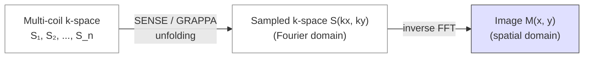

# Reconstruction

> Inverting the forward model $y = Ax + n$ to recover the image $x$ from the measurements $y$. The mathematical core of medical imaging.

## 1. Theory

Reconstruction is an **inverse problem**. In practice $A$ is ill-conditioned and the measurements are noisy, so there is no unique exact $x$. We pick the "best" estimator by combining:

- A **data-fidelity term** $\|Ax - y\|^2_W$ that says the image should explain the measurements.
- A **regularisation** $R(x)$ that encodes prior knowledge (smoothness, sparsity, deep-net prior).

The general regularised reconstruction is

$$
\hat x = \arg\min_x \; \tfrac{1}{2}\|Ax - y\|^2_W + \lambda R(x)
$$

Different choices give different families: analytic ($R = 0$, closed form), iterative regularised, model-based, learned-prior.

Two families of estimators dominate practice:

- **Analytic** — closed-form inversions valid when $A$ is well-conditioned and noise is benign. FBP for CT, inverse FFT for MRI.
- **Iterative statistical** — model the noise distribution explicitly; solve iteratively. MLEM / OSEM for PET, compressed sensing for MRI, model-based CT.

## 2. Mathematics

### Analytic — filtered back-projection (FBP) for CT

The **Fourier Slice Theorem** says the 1D Fourier transform of a projection $p(\theta, s)$ equals a radial line in the 2D Fourier transform of the image. Hence:

$$
\mu(\vec r) = \int_0^\pi \int_{-\infty}^{\infty} P(\theta, k_s)\, |k_s|\, e^{j 2\pi k_s (x\cos\theta + y\sin\theta)}\, dk_s\, d\theta
$$

Algorithm: take projections, filter each by $|k_s|$ (the **ramp filter** + a window to suppress noise), back-project across the image, sum.

### Analytic — inverse FFT for Cartesian MRI

If k-space is sampled on a Cartesian grid, the image is simply the inverse DFT:

$$
M(\vec r) = \mathrm{IFFT}\{S(\vec k)\}
$$

Multi-coil data are combined either by **root-sum-of-squares** (no phase) or **SENSE / GRAPPA** unfolding when k-space is under-sampled.

### k-space → image (Cartesian MR) at a glance



*<small>The MRI reconstruction shortcut: when k-space is fully sampled, the image is just an inverse FFT; parallel imaging recovers under-sampled data using coil sensitivity profiles. Original figure.</small>*

### Iterative — MLEM / OSEM for PET

PET measurements follow $y_i \sim \text{Poisson}(\sum_j A_{ij} x_j)$. Maximum-likelihood expectation-maximisation gives:

$$
x_j^{(n+1)} = \frac{x_j^{(n)}}{\sum_i A_{ij}} \sum_i A_{ij}\,\frac{y_i}{\sum_k A_{ik} x_k^{(n)}}
$$

**OSEM** ([Hudson & Larkin, 1994](https://doi.org/10.1109/42.363108)) accelerates by processing ordered subsets of projections per iteration.

### Iterative — compressed sensing MRI

Reconstruct from **under-sampled** k-space by enforcing sparsity in a transform domain $\Psi$ (wavelets, finite differences):

$$
\hat x = \arg\min_x \; \tfrac{1}{2}\|F_\Omega x - y\|^2_2 + \lambda \|\Psi x\|_1
$$

Solved by ISTA / FISTA / ADMM. Requirements: incoherent sampling, sparse signal, non-linear reconstruction. See [Lustig et al., 2007](https://doi.org/10.1002/mrm.21391).

### Iterative — model-based / regularised

Generalise:

$$
\hat x = \arg\min_x \; D(Ax, y) + \lambda R(x)
$$

where $D$ is the data-fidelity (Gaussian → $\ell_2$, Poisson → KL), $R$ is the prior. Solved with gradient methods, primal-dual (Chambolle-Pock), ADMM, half-quadratic splitting.

### Learned reconstruction — deep image prior, unrolled networks

Modern recon increasingly replaces $R$ with a learned prior:

- **End-to-end CNN** — train a U-Net to map zero-filled $A^T y$ to $x$.
- **Unrolled networks** (variational networks, MoDL, [Aggarwal et al., 2019](https://doi.org/10.1109/TMI.2018.2865356)) — unfold $K$ iterations of an iterative solver into a trainable graph; learn the prior / proximal operator.
- **Diffusion models** as priors ([Chung et al., 2023](https://doi.org/10.48550/arXiv.2209.14687)) — sample posteriors over $x \mid y$.

## 3. Steps — generic iterative reconstruction

```text
1. Initialise x⁰ (often A^T y or zero).
2. For k = 0, 1, 2, ...
     a. Forward project: ŷ = A x^k
     b. Compute residual / log-likelihood gradient
     c. Apply regularisation step (denoising, sparsity, learned prior)
     d. Update x^{k+1}
3. Stop when objective change < tolerance or k = max_iter.
4. Post-process: positivity constraint, smoothing, scaling.
```

For CT/MR/PET the only modality-specific code is $A$ and $A^T$ and the noise model.

## 4. Per-modality reconstruction

### MRI

- **Cartesian fully-sampled** — straight inverse FFT.
- **Cartesian under-sampled** — SENSE ([Pruessmann 1999](https://doi.org/10.1002/(SICI)1522-2594(199911)42:5%3C952::AID-MRM16%3E3.0.CO;2-S)), GRAPPA ([Griswold 2002](https://doi.org/10.1002/mrm.10171)).
- **Compressed sensing** — non-Cartesian + sparsity prior ([Lustig 2007](https://doi.org/10.1002/mrm.21391)).
- **Non-Cartesian** — radial, spiral; recon via NUFFT.
- **Deep learning** — fastMRI challenge ([Knoll et al., 2020](https://doi.org/10.1148/ryai.2020190007)); variational networks; diffusion-prior posterior sampling.

### CT

- **Filtered back-projection** — fast, vendor default for many decades.
- **Model-based iterative reconstruction (MBIR)** — explicit physics model, lower dose, longer compute (Veo, ASiR, IMR).
- **Deep-learning CT** — sinogram-to-image or image-to-image post-processing for low-dose CT.

### PET

- **OSEM** — vendor default, with point-spread function modelling and time-of-flight when available.
- **Q.Clear / BSREM** — block-sequential regularised; reduces noise without resolution loss.
- **Deep-learning PET denoising** — train on high-count / low-count pairs.

### Ultrasound

- **Delay-and-sum (DAS)** beamforming — classical.
- **Adaptive beamforming** (minimum variance, coherence factor).
- **Plane-wave compounding + deep learning** for ultrafast imaging.

## 5. Practical example — compressed-sensing MRI in 30 lines

```python
import numpy as np
import sigpy as sp                       # https://sigpy.readthedocs.io
import sigpy.mri as mr

# Synthesise a single-coil k-space and an under-sampling mask.
img = sp.shepp_logan((256, 256))
F   = sp.linop.FFT(img.shape)
ksp = F * img

mask = mr.poisson(img.shape, accel=4, calib=(24, 24))
A    = sp.linop.Multiply(img.shape, mask) * F
y    = A * img

# Total-variation regularised reconstruction with FISTA.
recon = mr.app.TotalVariationRecon(y, mps=np.ones_like(img)[None],
                                   weights=mask, lamda=1e-3,
                                   max_iter=100).run()
```

The classical CS-MRI pipeline: under-sample with a Poisson-disc mask, solve $\min_x \|Ax - y\|^2 + \lambda \|\nabla x\|_1$ with FISTA. SigPy ([docs](https://sigpy.readthedocs.io)) provides clean linear-operator abstractions; ImageMRI ([here](https://github.com/mikgroup/sigpy)) for advanced uses.

## 6. Evaluation — how do we know a reconstruction is good?

For modalities with a ground truth (phantom, fully-sampled reference):

- **PSNR** — $10 \log_{10} (\text{MAX}^2 / \text{MSE})$.
- **SSIM** — perceptual structural similarity ([Wang et al., 2004](https://doi.org/10.1109/TIP.2003.819861)).
- **Resolution / MTF** — point-spread function FWHM.

For deep-learning recon, **always** evaluate on out-of-distribution (different scanner, pathology) to detect hallucination ([Antun et al., 2020](https://doi.org/10.1073/pnas.1907377117)). Reconstruction quality on a held-out test set is not the same as robustness.

## 7. Inverse-crime warnings

Three traps in evaluation:

- **Inverse crime** — using the same $A$ for both data generation and reconstruction inflates metrics; use a higher-resolution forward model when synthesising test data.
- **Reference contamination** — comparing under-sampled recon to a fully-sampled reference made with the same coil sensitivities ignores model mismatch.
- **Hallucination** — DL recon can synthesise plausible structure that isn't there. The Antun et al. paper above is required reading.

## 8. References

1. **Hudson HM, Larkin RS.** Accelerated image reconstruction using ordered subsets of projection data. *IEEE Trans Med Imaging.* 1994;13(4):601-609. [doi:10.1109/42.363108](https://doi.org/10.1109/42.363108)
2. **Lustig M, Donoho D, Pauly JM.** Sparse MRI: the application of compressed sensing for rapid MR imaging. *Magn Reson Med.* 2007;58(6):1182-1195. [doi:10.1002/mrm.21391](https://doi.org/10.1002/mrm.21391)
3. **Pruessmann KP, Weiger M, Scheidegger MB, Boesiger P.** SENSE: sensitivity encoding for fast MRI. *Magn Reson Med.* 1999;42(5):952-962.
4. **Griswold MA, Jakob PM, Heidemann RM, et al.** Generalized autocalibrating partially parallel acquisitions (GRAPPA). *Magn Reson Med.* 2002;47(6):1202-1210. [doi:10.1002/mrm.10171](https://doi.org/10.1002/mrm.10171)
5. **Aggarwal HK, Mani MP, Jacob M.** MoDL: model-based deep learning architecture for inverse problems. *IEEE Trans Med Imaging.* 2019;38(2):394-405. [doi:10.1109/TMI.2018.2865356](https://doi.org/10.1109/TMI.2018.2865356)
6. **Knoll F, Murrell T, Sriram A, et al.** Advancing machine learning for MR image reconstruction with an open competition. *Radiol Artif Intell.* 2020;2(1):e190007. [doi:10.1148/ryai.2020190007](https://doi.org/10.1148/ryai.2020190007) — fastMRI.
7. **Chung H, Kim J, Mccann MT, Klasky ML, Ye JC.** Diffusion Posterior Sampling for General Noisy Inverse Problems. *ICLR.* 2023. [arXiv:2209.14687](https://doi.org/10.48550/arXiv.2209.14687)
8. **Antun V, Renna F, Poon C, Adcock B, Hansen AC.** On instabilities of deep learning in image reconstruction and the potential costs of AI. *PNAS.* 2020;117(48):30088-30095. [doi:10.1073/pnas.1907377117](https://doi.org/10.1073/pnas.1907377117)
9. **Wang Z, Bovik AC, Sheikh HR, Simoncelli EP.** Image quality assessment: from error visibility to structural similarity. *IEEE Trans Image Process.* 2004;13(4):600-612. [doi:10.1109/TIP.2003.819861](https://doi.org/10.1109/TIP.2003.819861)
10. **Boyd S, Parikh N, Chu E, Peleato B, Eckstein J.** Distributed optimization and statistical learning via the alternating direction method of multipliers. *Found Trends Mach Learn.* 2011;3(1):1-122. [doi:10.1561/2200000016](https://doi.org/10.1561/2200000016) — ADMM.

## Where to next

[Enhancement & quality](enhancement.md) — denoising, bias correction, and artifact removal on the reconstructed image.
