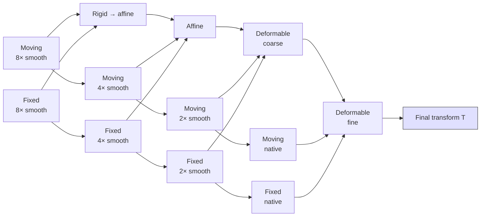

# Registration

> Finding the spatial transformation that aligns one image to another. The geometric backbone of multi-modal analysis, longitudinal studies, atlas-based segmentation, and group statistics.

## 1. Theory

Registration finds a transformation $T: \Omega_M \to \Omega_F$ that warps a **moving image** $M$ onto a **fixed image** $F$ so a similarity metric is optimised:

$$
\hat T = \arg\min_T\; D(F, M \circ T) + \lambda R(T)
$$

- $D$ — image-similarity metric (SSD, NCC, MI).
- $R(T)$ — regularisation on the transformation (smoothness, invertibility).
- $\lambda$ — trade-off.

Three transformation families:

- **Rigid** — 6 DoF (3 rotation + 3 translation). Same modality within a subject (motion correction, longitudinal).
- **Affine** — 12 DoF (adds scale + shear). Cross-modal within a subject; coarse cross-subject.
- **Deformable / diffeomorphic** — millions of DoF; non-linear warps for cross-subject normalisation, atlas-based segmentation.

## 2. Mathematics

### Transformation models

Rigid:

$$
T(\vec r) = R \vec r + \vec t, \qquad R \in SO(3),\; \vec t \in \mathbb{R}^3
$$

Affine:

$$
T(\vec r) = A \vec r + \vec t, \qquad A \in GL(3)
$$

Diffeomorphic — $T = \phi_1$, the time-1 flow of a velocity field:

$$
\frac{d \phi_t}{dt} = v_t(\phi_t), \qquad \phi_0 = \mathrm{Id}
$$

Stationary velocity: $\phi = \exp(v)$, computed by scaling-and-squaring. Time-varying velocity: the LDDMM framework ([Beg et al., 2005](https://doi.org/10.1023/B:VISI.0000043755.93987.aa)).

### Similarity metrics

- **Sum of squared differences (SSD)** — same-modality, same-contrast:

$$
D_{\mathrm{SSD}}(F, M_T) = \sum_v (F(v) - M_T(v))^2
$$

- **Normalised cross-correlation (NCC)** — robust to global intensity changes:

$$
D_{\mathrm{NCC}}(F, M_T) = -\frac{\sum_v (F - \bar F)(M_T - \bar M_T)}{\sqrt{\sum_v (F - \bar F)^2 \sum_v (M_T - \bar M_T)^2}}
$$

- **Mutual information (MI)** ([Maes et al., 1997](https://doi.org/10.1109/42.563664); [Wells et al., 1996](https://doi.org/10.1016/S1361-8415(01)80004-9)) — multi-modal:

$$
\mathrm{MI}(F, M_T) = \sum_{f, m} p(f, m)\, \log \frac{p(f, m)}{p(f)\, p(m)}
$$

estimated via Parzen-window joint histograms. Mattes MI ([Mattes et al., 2003](https://doi.org/10.1109/TMI.2002.806275)) is the canonical neuroimaging variant.

### Regularisation

For diffeomorphic registration:

$$
R(v) = \|L v\|^2_{L^2}
$$

where $L$ is a differential operator (e.g. $L = (I - \alpha \nabla^2)^k$) controlling smoothness. The Beltrami flow, viscous-fluid, demons regularisation are all instances.

### Optimisation

- **Powell** for low-DoF rigid/affine.
- **Gradient descent + line search** for affine.
- **Symmetric Normalisation (SyN)** — symmetric pair of forward and backward velocity fields composed at half-time; the workhorse in ANTs ([Avants et al., 2008](https://doi.org/10.1016/j.media.2007.06.004)).
- **L-BFGS** for many medium-DoF parameterisations.

### Multi-resolution / pyramid strategy

Almost every classical registration uses a pyramid: start at coarse resolution to escape local minima, refine to native resolution. Gaussian pyramids with `[8 4 2 1]` voxel-smoothing schedules are standard.



*<small>The coarse-to-fine pyramid in classical registration. Solves the local-minimum problem at coarse scales and refines accuracy at fine scales. Original figure.</small>*

## 3. Steps — generic registration pipeline

1. **Preprocess** both images: bias correction, intensity normalisation, skull strip (if appropriate).
2. **Initialise** — centre-of-mass alignment or identity.
3. **Rigid** — coarse → fine pyramid; SSD or MI.
4. **Affine** — initialise from rigid result; same metric.
5. **Deformable / SyN** — initialise from affine; coarse-to-fine velocity field.
6. **Apply transform** to all derived images (segmentations, statistical maps) using the same $T$.
7. **QC** — overlay edges or use a quantitative metric (Dice on a known label, target-registration error on landmarks).

## 4. Special cases in neuroimaging

### Within-subject across-modality

T1w ↔ FLAIR, T1w ↔ T2*, T1w ↔ DWI b=0. Use **affine** + **MI**. Boundary-based registration (BBR, [Greve & Fischl, 2009](https://doi.org/10.1016/j.neuroimage.2009.06.060)) refines the fit using cortical-WM boundaries from FreeSurfer.

### Across subjects (normalisation to template)

Non-linear registration to MNI152 / fsLR. ANTs SyN, FSL FNIRT, DARTEL (SPM), or VoxelMorph for fast inference. Always pin the template version ([TemplateFlow](https://www.templateflow.org)).

### Longitudinal

A subject scanned multiple times. Use **subject-specific halfway template** to avoid bias toward any one timepoint (FreeSurfer longitudinal stream; ANTs longitudinal pipeline).

### Distortion correction (within-acquisition)

EPI ↔ T1w correction via field maps (`topup`) or fieldmap-less methods (SyN-SDC); see [Fundamentals → Preprocessing](../preprocessing.md).

### Atlas-based segmentation

Register atlas labels into subject space (or vice versa). Used by FreeSurfer aseg, multi-atlas + JLF, hippocampal subfield pipelines.

### Group template construction

Iterate registration + averaging to build a study-specific template (ANTs `buildtemplateparallel`). Reduces inter-subject bias.

## 5. Practical example — ANTs SyN registration

```bash
# T1w-to-MNI152 with affine + SyN
antsRegistrationSyN.sh \
    -d 3 \
    -f MNI152_T1_1mm_brain.nii.gz \
    -m sub-001_T1w_brain.nii.gz \
    -o sub-001_to_MNI_ \
    -t s            # s = rigid + affine + SyN

# Apply the same transform to the label map
antsApplyTransforms \
    -d 3 \
    -i sub-001_aparc+aseg.nii.gz \
    -r MNI152_T1_1mm_brain.nii.gz \
    -t sub-001_to_MNI_1Warp.nii.gz \
    -t sub-001_to_MNI_0GenericAffine.mat \
    -o sub-001_aparc+aseg_in_MNI.nii.gz \
    -n MultiLabel
```

Three details:

- **Bias-corrected, skull-stripped** brains as input — SyN's similarity metric is sensitive to non-brain intensities.
- **`-n MultiLabel`** for segmentations — uses majority-label interpolation, not linear.
- **Concatenate transforms in reverse order** when applying — `antsApplyTransforms` applies right-to-left.

## 6. Practical example — VoxelMorph (deep-learning registration)

```python
import voxelmorph as vxm
import tensorflow as tf

# Build a registration U-Net that predicts a displacement field
vol_shape = (160, 192, 224)
nb_unet_features = [[16, 32, 32, 32], [32, 32, 32, 32, 32, 16, 16]]
model = vxm.networks.VxmDense(vol_shape, nb_unet_features, int_steps=7)

# Loss: image similarity + smoothness on the displacement field
losses = [vxm.losses.NCC().loss, vxm.losses.Grad('l2').loss]
loss_weights = [1, 0.01]
model.compile(optimizer=tf.keras.optimizers.Adam(lr=1e-4),
              loss=losses, loss_weights=loss_weights)

# Train on pairs (moving, fixed); inference is a single forward pass
model.fit(generator, epochs=200, steps_per_epoch=100)
```

VoxelMorph ([Balakrishnan et al., 2019](https://doi.org/10.1109/TMI.2019.2897538)) replaces iterative optimisation with a learned U-Net. Inference is ~100 ms per pair on a GPU vs ~10 minutes for SyN. Accuracy is comparable on in-distribution data; OOD remains a concern.

## 7. Evaluation

- **Target registration error (TRE)** — Euclidean distance between corresponding landmarks. Gold standard when landmarks exist.
- **Dice / Jaccard on a known label** — overlap of warped masks; proxy for TRE.
- **Inverse consistency** — $T \circ T^{-1} \approx I$. Diffeomorphic algorithms minimise this by construction.
- **Visual QC** — checker-board overlays of fixed and warped moving images. Always do this on a few subjects.

## 8. Common pitfalls

- **Skull-stripping mismatch** — non-brain tissue dominates SSD/NCC; mask both images.
- **Bias-field uncorrected images** — drift across the image confuses MI.
- **Wrong pyramid schedule** — too coarse → miss fine detail; too fine → local minimum.
- **Initial misalignment** — if the centre-of-mass is far off, the first iteration may diverge; pre-align with a header-based or moments-of-inertia step.
- **Wrong interpolation for labels** — never use trilinear / cubic on integer label maps; use nearest-neighbour or majority-voting (`-n MultiLabel`).
- **Bias in cross-subject template** — if all subjects are warped to one subject's image, that subject's features dominate. Use an averaged template.

## 9. References

1. **Sotiras A, Davatzikos C, Paragios N.** Deformable medical image registration: a survey. *IEEE Trans Med Imaging.* 2013;32(7):1153-1190. [doi:10.1109/TMI.2013.2265603](https://doi.org/10.1109/TMI.2013.2265603)
2. **Maes F, Collignon A, Vandermeulen D, Marchal G, Suetens P.** Multimodality image registration by maximization of mutual information. *IEEE Trans Med Imaging.* 1997;16(2):187-198. [doi:10.1109/42.563664](https://doi.org/10.1109/42.563664)
3. **Wells WM, Viola P, Atsumi H, Nakajima S, Kikinis R.** Multi-modal volume registration by maximization of mutual information. *Med Image Anal.* 1996;1(1):35-51. [doi:10.1016/S1361-8415(01)80004-9](https://doi.org/10.1016/S1361-8415(01)80004-9)
4. **Mattes D, Haynor DR, Vesselle H, Lewellen TK, Eubank W.** PET-CT image registration in the chest using free-form deformations. *IEEE Trans Med Imaging.* 2003;22(1):120-128. [doi:10.1109/TMI.2002.806275](https://doi.org/10.1109/TMI.2002.806275)
5. **Avants BB, Epstein CL, Grossman M, Gee JC.** Symmetric diffeomorphic image registration with cross-correlation: evaluating automated labeling of elderly and neurodegenerative brain. *Med Image Anal.* 2008;12(1):26-41. [doi:10.1016/j.media.2007.06.004](https://doi.org/10.1016/j.media.2007.06.004) — SyN.
6. **Beg MF, Miller MI, Trouvé A, Younes L.** Computing large deformation metric mappings via geodesic flows of diffeomorphisms. *Int J Comput Vis.* 2005;61(2):139-157. [doi:10.1023/B:VISI.0000043755.93987.aa](https://doi.org/10.1023/B:VISI.0000043755.93987.aa) — LDDMM.
7. **Vercauteren T, Pennec X, Perchant A, Ayache N.** Diffeomorphic demons: efficient non-parametric image registration. *NeuroImage.* 2009;45(1 Suppl):S61-S72. [doi:10.1016/j.neuroimage.2008.10.040](https://doi.org/10.1016/j.neuroimage.2008.10.040)
8. **Ashburner J.** A fast diffeomorphic image registration algorithm. *NeuroImage.* 2007;38(1):95-113. [doi:10.1016/j.neuroimage.2007.07.007](https://doi.org/10.1016/j.neuroimage.2007.07.007) — DARTEL.
9. **Greve DN, Fischl B.** Accurate and robust brain image alignment using boundary-based registration. *NeuroImage.* 2009;48(1):63-72. [doi:10.1016/j.neuroimage.2009.06.060](https://doi.org/10.1016/j.neuroimage.2009.06.060) — BBR.
10. **Balakrishnan G, Zhao A, Sabuncu MR, Guttag J, Dalca AV.** VoxelMorph: a learning framework for deformable medical image registration. *IEEE Trans Med Imaging.* 2019;38(8):1788-1800. [doi:10.1109/TMI.2019.2897538](https://doi.org/10.1109/TMI.2019.2897538)
11. **Chen J, Frey EC, He Y, et al.** TransMorph: transformer for unsupervised medical image registration. *Med Image Anal.* 2022;82:102615. [doi:10.1016/j.media.2022.102615](https://doi.org/10.1016/j.media.2022.102615)
12. **Klein A, Andersson J, Ardekani BA, et al.** Evaluation of 14 nonlinear deformation algorithms applied to human brain MRI registration. *NeuroImage.* 2009;46(3):786-802. [doi:10.1016/j.neuroimage.2008.12.037](https://doi.org/10.1016/j.neuroimage.2008.12.037) — landmark benchmarking paper.

## Where to next

[Enhancement & quality](enhancement.md) — improving images before, during, or after registration.
