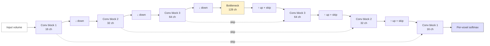

# Segmentation

> Labelling every voxel with its tissue class or anatomical region. The substrate for volumetry, ROI analyses, surgical planning, and most downstream statistics.

## 1. Theory

Segmentation produces a label map $L: \Omega \to \{1, \dots, K\}$ from an image $I: \Omega \to \mathbb{R}$. The classes are problem-defined: tissue type (GM / WM / CSF), anatomical region (84 DK regions), pathology (lesion / not-lesion), or fine subfields (hippocampal CA1 / CA2 / CA3 / DG).

Two conceptual axes:

- **Generative vs discriminative** — generative models $p(I \mid L)$ + prior $p(L)$ (atlas-based, GMM); discriminative models $p(L \mid I)$ directly (random forests, U-Net).
- **Hand-crafted vs learned features** — thresholds, gradients, textures vs learned convolutional features.

The modern landscape is overwhelmingly discriminative + learned, but the classical methods remain useful for sanity-checks, initialisation, and low-data regimes.

## 2. Mathematics

### Bayesian formulation

By Bayes,

$$
p(L \mid I) \propto p(I \mid L)\, p(L)
$$

- $p(I \mid L)$ — appearance model (Gaussian per class, intensity histogram, CNN output).
- $p(L)$ — spatial prior (atlas, Markov random field).

Maximum a posteriori (MAP) segmentation solves $\hat L = \arg\max_L p(L \mid I)$. Most classical algorithms are MAP estimators with different choices of $p(I \mid L)$ and $p(L)$.

### GMM with EM

Tissue segmentation often models intensities per class as Gaussian:

$$
p(I_v \mid L_v = k) = \mathcal{N}(I_v;\, \mu_k, \sigma_k^2)
$$

The **EM** algorithm alternates:

- **E-step**: $\gamma_{vk} = \dfrac{\pi_k\, \mathcal{N}(I_v; \mu_k, \sigma_k^2)}{\sum_{j} \pi_j\, \mathcal{N}(I_v; \mu_j, \sigma_j^2)}$
- **M-step**: update $\mu_k, \sigma_k^2, \pi_k$ from $\gamma$.

FSL FAST ([Zhang et al., 2001](https://doi.org/10.1109/42.906424)) is the canonical neuroimaging implementation, with an MRF prior to enforce spatial smoothness.

### Markov random field prior

$$
p(L) \propto \exp\!\left(-\beta \sum_{(v, w) \in \mathcal{N}} \mathbb{1}[L_v \neq L_w]\right)
$$

Encourages neighbouring voxels to share labels. Solved via iterated conditional modes, simulated annealing, or graph cuts.

### Active contours / level sets

Represent a contour as the zero level set of a function $\phi$ that evolves to minimise an energy:

$$
E(\phi) = \mu \int |\nabla H(\phi)|\,dx + \lambda_1 \int_{\phi > 0} (I - c_1)^2 dx + \lambda_2 \int_{\phi < 0} (I - c_2)^2 dx
$$

(Chan-Vese, [Chan & Vese, 2001](https://doi.org/10.1109/83.902291)). PDE evolution converges to a region that fits piecewise-constant intensities.

### Graph cuts

Pose binary segmentation as a min-cut on a graph with edges encoding pairwise smoothness and source/sink links encoding unary appearance terms. [Boykov & Funka-Lea, 2006](https://doi.org/10.1007/s11263-006-7934-5) is the textbook treatment.

### Multi-atlas segmentation + label fusion

Given $N$ pre-labelled atlases $(I_n, L_n)$ and target $I$:

1. Register each $I_n \to I$, warp labels $\tilde L_n$.
2. Fuse $\{\tilde L_n\}$ → final segmentation.

Fusion rules: majority voting, locally-weighted (similarity-weighted), STAPLE ([Warfield et al., 2004](https://doi.org/10.1109/TMI.2004.828354)), joint label fusion ([Wang et al., 2013](https://doi.org/10.1109/TPAMI.2012.143)). Strong on small datasets where DL overfits.

### Deep learning — U-Net family

The **U-Net** ([Ronneberger et al., 2015](https://doi.org/10.1007/978-3-319-24574-4_28); 3D extension [Çiçek et al., 2016](https://doi.org/10.1007/978-3-319-46723-8_49)) is an encoder-decoder with skip connections. The output is a per-voxel softmax over classes.



*<small>Schematic of the U-Net encoder-decoder with skip connections. After Ronneberger et al., 2015. Original figure.</small>*

Loss functions:

- **Cross-entropy** — pixelwise; weak under class imbalance.
- **Dice** — directly optimises overlap; tolerates imbalance:

$$
\mathcal{L}_{\mathrm{Dice}} = 1 - \frac{2 \sum_v p_v\, y_v + \epsilon}{\sum_v p_v + \sum_v y_v + \epsilon}
$$

- **Focal** — down-weights easy examples; rescues tiny lesions.
- **Combined CE + Dice** — the nnU-Net default.

### nnU-Net — the configured baseline

[nnU-Net](https://doi.org/10.1038/s41592-020-01008-z) (Isensee et al., 2021) auto-configures a U-Net from the dataset fingerprint (voxel spacing, patch size, batch size). It is the baseline to beat in any medical-segmentation paper.

### Promptable models — SAM and MedSAM

[SAM](https://doi.org/10.48550/arXiv.2304.02643) (Kirillov et al., 2023) trains a vision transformer to segment from a prompt (point / box). [MedSAM](https://doi.org/10.1038/s41467-024-44824-z) fine-tunes on medical-imaging masks. Zero/low-shot performance on novel anatomy without per-task training.

### Evaluation metrics

- **Dice coefficient** — $\mathrm{Dice} = 2|A \cap B| / (|A| + |B|)$.
- **Jaccard / IoU** — $|A \cap B| / |A \cup B|$.
- **Hausdorff distance (HD95)** — 95th-percentile boundary distance; robust to outliers.
- **Average symmetric surface distance (ASSD)** — average bidirectional surface error.
- **Volumetric similarity / volume error** — clinical relevance.

Always report per-class on multi-class problems; means hide failures.

## 3. Steps — generic segmentation pipeline

1. **Preprocess** — bias correction (N4), intensity normalisation, skull strip.
2. **Choose a segmentation framework** — atlas-based for fine-grained anatomy with few subjects, DL for large cohorts.
3. **Initialise** — atlas warp, intensity threshold, or zero.
4. **Refine** — EM / level set / DL forward pass.
5. **Post-process** — connected-component filtering, hole filling, morphological cleanup.
6. **QC** — visual + automated metrics; flag outliers.
7. **Export** — BIDS-Derivatives `*_dseg.nii.gz` + `*_dseg.tsv` lookup table.

## 4. Per-class neuroimaging segmentation tasks

| Task | Tools |
|---|---|
| GM / WM / CSF tissue segmentation | FSL FAST, ANTs Atropos, FreeSurfer aseg, SynthSeg |
| Cortical surface + DK parcellation | FreeSurfer recon-all, FastSurfer |
| Subcortical structures | FreeSurfer aseg, FIRST, SynthSeg |
| Hippocampal subfields | FreeSurfer + ASHS, HippUnfold |
| White-matter hyperintensities (WMH) | LPA / LGA (LST), WMH-SynthSeg, BIANCA, UNet-WMH |
| Brain tumours (BraTS) | nnU-Net BraTS winners, Swin UNETR |
| Multiple sclerosis lesions | nicMSlesions, MS-LAQ, lesion-related nnU-Net |
| Stroke lesions (ATLAS) | nnU-Net ATLAS, [ATLAS dataset](https://doi.org/10.1038/s41597-022-01401-7) |
| Cerebral microbleeds | SWI + deep learning detectors |

For neuro-AI specifically, [MONAI Bundles](https://docs.monai.io/en/stable/bundle.html) ship containerised, version-pinned segmentation pipelines that follow this pattern.

## 5. Practical example — nnU-Net on a 3D segmentation task

```bash
# 1. Convert your BIDS dataset to nnU-Net's expected layout
python scripts/bids_to_nnunet.py \
    --bids derivatives/raw_lesion \
    --task 501 --task-name LesionMS \
    --out $nnUNet_raw

# 2. Plan + preprocess (fingerprints the dataset)
nnUNetv2_plan_and_preprocess -d 501 --verify_dataset_integrity

# 3. Train all five folds (multi-GPU recommended)
for f in 0 1 2 3 4; do
  nnUNetv2_train 501 3d_fullres $f --npz
done

# 4. Ensemble + post-process
nnUNetv2_find_best_configuration 501 -c 3d_fullres
nnUNetv2_predict -i raw/imagesTs -o predictions \
    -d 501 -c 3d_fullres -f 0 1 2 3 4

# 5. Quantitative evaluation
python -c "import nnunetv2.evaluation.evaluate_predictions as e; \
e.compute_metrics_on_folder_simple('predictions/', 'labelsTs/', file_ending='.nii.gz')"
```

Five folds + ensemble + auto-configuration is what makes nnU-Net the strong baseline it is. Anything claiming to beat it should report on the same evaluation infrastructure.

## 6. Practical example — multi-atlas segmentation with ANTs

```bash
# Register N atlases → target
for a in atlas/sub-*; do
  antsRegistrationSyN.sh -d 3 -f target_T1w.nii.gz \
      -m $a/T1w.nii.gz -o $a/warped_ -t s
  antsApplyTransforms -d 3 \
      -i $a/labels.nii.gz \
      -r target_T1w.nii.gz \
      -t $a/warped_1Warp.nii.gz -t $a/warped_0GenericAffine.mat \
      -o $a/warped_labels.nii.gz -n MultiLabel
done

# Joint label fusion
antsJointLabelFusion.sh -d 3 -t target_T1w.nii.gz -o jlf_ \
    -g atlas/sub-*/T1w.nii.gz -l atlas/sub-*/warped_labels.nii.gz
```

JLF ([Wang et al., 2013](https://doi.org/10.1109/TPAMI.2012.143)) remains highly competitive when you only have 10-20 labelled atlases.

## 7. Common pitfalls

- **Class imbalance** — 99% background dominates loss; use Dice or focal loss.
- **Patch boundary artefacts** — segmenting overlapping patches without proper averaging (use sliding-window with Gaussian weighting).
- **Inconsistent label space** — make sure target and atlas use the same numbering; a `dseg.tsv` lookup table is mandatory.
- **Test on the wrong distribution** — a model trained on Siemens 3T fails on GE 1.5T. Cross-site / cross-scanner evaluation is essential.
- **Reporting only mean Dice** — small structures (subthalamic nucleus, fornix) may have Dice ~0.4 even in good models; report per-class.

## 8. References

1. **Zhang Y, Brady M, Smith S.** Segmentation of brain MR images through a hidden Markov random field model and the EM algorithm. *IEEE Trans Med Imaging.* 2001;20(1):45-57. [doi:10.1109/42.906424](https://doi.org/10.1109/42.906424) — FSL FAST.
2. **Ashburner J, Friston KJ.** Unified segmentation. *NeuroImage.* 2005;26(3):839-851. [doi:10.1016/j.neuroimage.2005.02.018](https://doi.org/10.1016/j.neuroimage.2005.02.018) — SPM segmentation.
3. **Avants BB, Tustison NJ, Wu J, Cook PA, Gee JC.** An open source multivariate framework for n-tissue segmentation with evaluation on public data. *Neuroinformatics.* 2011;9(4):381-400. [doi:10.1007/s12021-011-9109-y](https://doi.org/10.1007/s12021-011-9109-y) — Atropos.
4. **Chan TF, Vese LA.** Active contours without edges. *IEEE Trans Image Process.* 2001;10(2):266-277. [doi:10.1109/83.902291](https://doi.org/10.1109/83.902291)
5. **Boykov Y, Funka-Lea G.** Graph cuts and efficient N-D image segmentation. *Int J Comput Vis.* 2006;70(2):109-131. [doi:10.1007/s11263-006-7934-5](https://doi.org/10.1007/s11263-006-7934-5)
6. **Warfield SK, Zou KH, Wells WM.** Simultaneous truth and performance level estimation (STAPLE). *IEEE Trans Med Imaging.* 2004;23(7):903-921. [doi:10.1109/TMI.2004.828354](https://doi.org/10.1109/TMI.2004.828354)
7. **Wang H, Suh JW, Das SR, Pluta JB, Craige C, Yushkevich PA.** Multi-atlas segmentation with joint label fusion. *IEEE Trans Pattern Anal Mach Intell.* 2013;35(3):611-623. [doi:10.1109/TPAMI.2012.143](https://doi.org/10.1109/TPAMI.2012.143)
8. **Ronneberger O, Fischer P, Brox T.** U-Net: Convolutional Networks for Biomedical Image Segmentation. *MICCAI.* 2015. [doi:10.1007/978-3-319-24574-4_28](https://doi.org/10.1007/978-3-319-24574-4_28)
9. **Çiçek Ö, Abdulkadir A, Lienkamp SS, Brox T, Ronneberger O.** 3D U-Net: learning dense volumetric segmentation from sparse annotation. *MICCAI.* 2016. [doi:10.1007/978-3-319-46723-8_49](https://doi.org/10.1007/978-3-319-46723-8_49)
10. **Isensee F, Jaeger PF, Kohl SAA, Petersen J, Maier-Hein KH.** nnU-Net: a self-configuring method for deep-learning-based biomedical image segmentation. *Nat Methods.* 2021;18(2):203-211. [doi:10.1038/s41592-020-01008-z](https://doi.org/10.1038/s41592-020-01008-z)
11. **Kirillov A, Mintun E, Ravi N, et al.** Segment Anything. *arXiv:2304.02643.* 2023. [doi:10.48550/arXiv.2304.02643](https://doi.org/10.48550/arXiv.2304.02643)
12. **Ma J, He Y, Li F, Han L, You C, Wang B.** Segment Anything in Medical Images. *Nat Commun.* 2024;15:654. [doi:10.1038/s41467-024-44824-z](https://doi.org/10.1038/s41467-024-44824-z) — MedSAM.
13. **Billot B, Greve DN, Puonti O, et al.** SynthSeg: domain randomisation for segmentation of brain scans of any contrast and resolution. *Med Image Anal.* 2023;86:102789. [doi:10.1016/j.media.2023.102789](https://doi.org/10.1016/j.media.2023.102789)
14. **Hatamizadeh A, Nath V, Tang Y, Yang D, Roth HR, Xu D.** Swin UNETR. *arXiv:2201.01266.* 2022. [doi:10.48550/arXiv.2201.01266](https://doi.org/10.48550/arXiv.2201.01266)

## Exercises

1. **Dice limitations.** Construct two binary masks where Dice ≥ 0.9 but a small clinically-critical structure is completely missed. Propose a complementary metric.
2. **Class-balanced patch sampling.** Sketch a 3D U-Net training loop that ensures every batch contains at least one foreground patch per class.
3. **Cross-site evaluation.** Why does within-site CV typically overstate generalisation? Design a held-out site experiment.

??? success "Solutions"
    1. A 100-voxel structure missed in a 100k-voxel volume: missing it drops Dice by ~0.001. Pair Dice with per-class sensitivity at fixed volume thresholds, or HD95.
    2. Use `RandCropByPosNegLabeld(pos=1, neg=1)` from MONAI; concatenate per-class samplers when N classes > 2.
    3. Within-site CV shares scanner / protocol / population biases; leave-one-site-out is the honest test.

## Where to next

[Registration](registration.md) — aligning segmentations across subjects and modalities.
