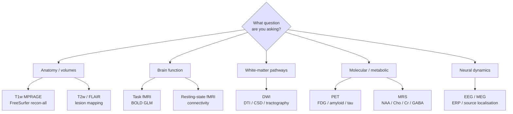

# Modalities

> What MRI, DWI, fMRI, PET, and EEG actually measure — and what their raw data looks like on disk.

If you've been told "we acquired diffusion at the scanner today, can you preprocess it?", this page is for you. Each modality below gets a one-paragraph "what is it" plus a one-paragraph "what's in the file".

## MRI (anatomical / structural)

**What it measures.** A magnetic field (typically 1.5 T or 3 T) and radio-frequency pulses produce a 3D map of proton density in tissue, modulated by relaxation parameters. The two most common contrasts:

- **T1-weighted** — bright white matter, dark CSF. The reference for cortical anatomy.
- **T2-weighted / FLAIR** — bright CSF (or suppressed in FLAIR), highlights lesions and oedema.

**What you get on disk.** A single 3D volume per acquisition, typically 1 mm isotropic. As a NIfTI file: a 256×256×176 (or similar) array of `int16` or `float32` voxels, with an affine matrix that maps voxel indices into world coordinates. The companion JSON sidecar records the sequence (`MPRAGE`, `SPACE`, etc.) and timing parameters (TR, TE, TI, flip angle).

## Diffusion-weighted imaging (DWI)

**What it measures.** A sensitisation gradient is added so that water molecules diffusing along that direction lose signal. By acquiring many directions, you can model the local diffusion ellipsoid and reconstruct white-matter fibre pathways (tractography).

**What you get on disk.** A 4D volume — 3D spatial + one direction-index axis. Plus two text sidecars:

- `*_dwi.bval` — one b-value per acquired volume (units: s/mm²). A b=0 volume is unweighted; b≈1000 is "standard"; b≥3000 is multi-shell.
- `*_dwi.bvec` — one unit vector per volume describing the gradient direction.

Typical shape: 96×96×60×64 (96 directions × 60 axial slices, etc.). Single-shell DWI ≈ 30–60 volumes; multi-shell HARDI ≈ 100–250.

## Functional MRI (fMRI)

**What it measures.** The BOLD (blood-oxygen-level-dependent) signal: as a brain region becomes active, blood flow increases, ratio of oxy/deoxy haemoglobin changes, and the T2*-weighted signal rises. Indirect proxy for neural activity at the second-to-tens-of-seconds scale.

**What you get on disk.** A 4D volume — 3D spatial + one time axis. Typical shape: 80×80×40 × 300 volumes at TR ≈ 2 s. Resting-state runs are 5–15 minutes; task runs vary. The JSON sidecar carries the task name, TR, slice timing, phase-encoding direction (`j-`, `j`), and any task-events file lives in `*_events.tsv`.

## PET (positron emission tomography)

**What it measures.** A radio-labelled tracer (FDG for glucose, amyloid-targeted tracers for Alzheimer's research, etc.) is injected and the resulting annihilation photons are detected. The image is a map of tracer concentration over time.

**What you get on disk.** 3D static reconstructions or 4D dynamic series (3D spatial + frames over time). NIfTI for the volumes, with a more elaborate JSON sidecar covering injected dose, tracer, decay correction, attenuation correction, and reconstruction parameters. PET data lives in BIDS under the `pet/` datatype folder.

## EEG / MEG / iEEG

**What it measures.** Electrodes (EEG, intracranial) or SQUID magnetometers (MEG) record electrical activity directly. Sub-millisecond temporal resolution; relatively poor spatial resolution.

**What you get on disk.** A 2D array — channels × time samples — at typically 250–10,000 Hz. BIDS uses:

- `*_eeg.edf` / `*_eeg.bdf` / `*_eeg.vhdr` (BrainVision) / `*_eeg.set` (EEGLAB) — vendor-format raw data.
- `*_channels.tsv` — one row per electrode, with units, type, and reference.
- `*_electrodes.tsv` + `*_coordsystem.json` — physical positions of the electrodes.

Unlike imaging modalities, EEG raw files do not contain spatial information by default — the geometry is in a separate sidecar.

## Quick decision table

| If the data looks like… | …it's probably |
| --- | --- |
| Single 3D NIfTI, no time | Structural MRI (T1w, T2w, FLAIR) |
| 4D NIfTI + `.bval` + `.bvec` | DWI |
| 4D NIfTI + `_events.tsv` | Task fMRI |
| 4D NIfTI + `_task-rest_` in the filename | Resting-state fMRI |
| 3D or 4D NIfTI in a `pet/` folder + tracer sidecar | PET |
| `.edf` / `.vhdr` / `.set` + channels sidecar | EEG |

## Modality decision tree

*<small>Picking a modality from the research question. Original figure.</small>*

## Visual references

Authoritative galleries to compare what each modality looks like on real data:

- **Radiopaedia — MRI sequence atlas.** [https://radiopaedia.org/articles/mri-sequences-overview](https://radiopaedia.org/articles/mri-sequences-overview) — side-by-side T1, T2, FLAIR, DWI, SWI examples curated by radiologists.
- **OpenNeuro example datasets.** [https://openneuro.org](https://openneuro.org) — every modality in BIDS-organised real data.
- **HCP visualisation gallery.** [https://www.humanconnectome.org/study/hcp-young-adult/data-releases](https://www.humanconnectome.org/study/hcp-young-adult/data-releases) — high-quality multimodal references.
- **MRI Questions illustrated primers.** [https://mriquestions.com](https://mriquestions.com) — pulse-sequence diagrams, k-space, contrast mechanisms.
- **NIH NIMH Healthy Volunteer Dataset** (open). [https://nda.nih.gov/edit_collection.html?id=2914](https://nda.nih.gov/edit_collection.html?id=2914)

## Where to next

[Coordinate systems](coordinate-systems.md) — how voxel indices, scanner space, and standard templates relate.
