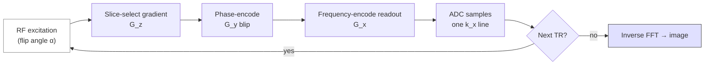

# MRI sequences

> What the scanner actually does for each acquisition — physics, parameters, artifacts, and the derivatives each sequence produces.

These chapters are the physics layer underneath [Modalities](../modalities.md). They are written for people who want to understand *why* a sequence looks the way it does, so they can read protocol PDFs critically and tune acquisitions for their study.

## Sequences

- [**MPRAGE**](mprage.md) — magnetization-prepared rapid gradient echo. T1-weighted structural; the FreeSurfer / cortical-thickness input.
- [**DWI**](dwi.md) — diffusion-weighted imaging. Stejskal-Tanner gradients, b-values, ADC; the basis for tractography.
- [**EPI**](epi.md) — echo-planar imaging. The fast readout shared by BOLD fMRI and DWI.
- [**FLAIR**](flair.md) — fluid-attenuated inversion recovery. CSF-suppressed T2 contrast; lesion detection.
- [**GRE**](gre.md) — gradient echo. The building block for T2*, SWI, MRA, and the EPI readout.
- [**SWI**](swi.md) — susceptibility-weighted imaging. Microbleeds, veins, iron deposition.
- [**Spin echo**](spin-echo.md) — the original refocused contrast; foundation for FLAIR, TSE, and DWI prepulses.

Each chapter ends with a peer-reviewed reference list so you can dig into the original physics literature.

## How a generic MR sequence is built

*<small>The building blocks every MR sequence shares. Each chapter below tells you how a specific sequence customises this skeleton. Original figure.</small>*

## Visual references

- **MRI Questions** (Allen D. Elster). [https://mriquestions.com](https://mriquestions.com) — illustrated primer covering every pulse-sequence type.
- **FreeSurfer recommended acquisitions.** [https://surfer.nmr.mgh.harvard.edu/fswiki/MorphometryStability](https://surfer.nmr.mgh.harvard.edu/fswiki/MorphometryStability) — vendor-protocol comparisons for structural MRI.
- **Vendor pulse-sequence atlases** (Siemens MAGNETOM, Philips, GE) — sequence diagrams ship with each scanner's protocol manual; always archive a copy with your study.
