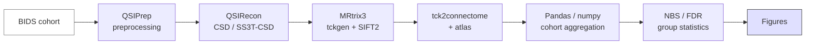

# Tutorial — DWI cohort tractography

> From a BIDS cohort of diffusion data to a group-level connectivity analysis. ~3 hours of compute, ~1 hour of reading.

## Prerequisites

- Familiarity with [Fundamentals → MRI sequences → DWI](../fundamentals/sequences/dwi.md) and [Neuroimaging Analysis → Diffusion & tractography](../analysis/diffusion.md).
- Apptainer or Docker installed.
- ~50 GB free disk + ~16 GB RAM per subject.
- Optional: FreeSurfer license if you want HSVS reconstruction.

## Pipeline overview



## 1. Get the data

```bash
# An openly-available DWI cohort
mkdir -p data && cd data
datalad install ///openneuro/ds002785
datalad get ds002785/sub-000[1-5]/dwi/*.nii.gz
datalad get ds002785/sub-000[1-5]/dwi/*.bval
datalad get ds002785/sub-000[1-5]/dwi/*.bvec
datalad get ds002785/sub-000[1-5]/anat/*.nii.gz
cd ..
```

If you don't have DataLad: download manually from the OpenNeuro web UI. We use five subjects for the tutorial; real analyses need many more.

## 2. Validate before any compute

```bash
npx bids-validator data/ds002785
```

Fix any errors before running QSIPrep. See [BIDS toolkit → Validation](../bids/validation.md).

## 3. Run QSIPrep per subject

```bash
mkdir -p data/derivatives data/work
for sub in sub-0001 sub-0002 sub-0003 sub-0004 sub-0005; do
  apptainer run --cleanenv \
    -B data/ds002785:/data:ro \
    -B data/derivatives:/out \
    -B data/work:/work \
    -B ~/freesurfer/license.txt:/license.txt:ro \
    qsiprep.sif \
    /data /out participant --participant-label "${sub#sub-}" \
    --work-dir /work \
    --output-resolution 2.0 \
    --fs-license-file /license.txt \
    --nthreads 8 --mem-mb 30000
done
```

On a cluster: convert the loop into a Slurm array. See [Computing → HPC and Slurm](../computing/hpc-slurm.md).

## 4. Run QSIRecon for CSD reconstruction

```bash
for sub in sub-0001 sub-0002 sub-0003 sub-0004 sub-0005; do
  apptainer run --cleanenv \
    -B data/ds002785:/data:ro \
    -B data/derivatives:/out \
    qsirecon.sif \
    /data /out participant --participant-label "${sub#sub-}" \
    --recon-spec mrtrix_multishell_msmt_ACT-hsvs \
    --fs-license-file /license.txt
done
```

## 5. Generate tractograms with MRtrix3

For each subject:

```bash
SUB=sub-0001
REC=data/derivatives/qsirecon/$SUB/dwi

tckgen "$REC/${SUB}_wm_fod.mif" \
       "$REC/${SUB}_tracks_10M.tck" \
       -act "$REC/${SUB}_5tt.nii.gz" \
       -backtrack -seed_dynamic "$REC/${SUB}_wm_fod.mif" \
       -select 10M -minlength 5 -maxlength 250 \
       -nthreads 8

tcksift2 "$REC/${SUB}_tracks_10M.tck" \
         "$REC/${SUB}_wm_fod.mif" \
         "$REC/${SUB}_weights.txt"
```

## 6. Build a Desikan-Killiany connectome

```bash
tck2connectome "$REC/${SUB}_tracks_10M.tck" \
               "$REC/${SUB}_aparc+aseg_inDWI.nii.gz" \
               "$REC/${SUB}_dk_connectome.csv" \
               -tck_weights_in "$REC/${SUB}_weights.txt" \
               -symmetric -zero_diagonal
```

You now have an 84×84 weighted connectome per subject.

## 7. Aggregate into a cohort table

```python
import numpy as np, pandas as pd
from pathlib import Path

rows = []
for sub_dir in sorted(Path("data/derivatives/qsirecon").glob("sub-*")):
    sub = sub_dir.name.split("-", 1)[1]
    csv = next(sub_dir.glob("**/*_dk_connectome.csv"))
    conn = np.loadtxt(csv, delimiter=",")
    triu = conn[np.triu_indices_from(conn, k=1)]   # 3486-vector
    rows.append([sub] + triu.tolist())

cols = ["subject_id"] + [f"edge_{i}_{j}"
                          for i in range(84) for j in range(i+1, 84)]
df = pd.DataFrame(rows, columns=cols)
df.to_parquet("data/cohort_connectomes.parquet")
print(df.shape)
```

## 8. Run a group-level edge-wise test

```python
import numpy as np
from scipy import stats
from statsmodels.stats.multitest import multipletests

groups = ...  # your participants.tsv-derived group label
y = df.drop(columns="subject_id").values
g = (groups == "patient").astype(int)

t = np.zeros(y.shape[1])
p = np.zeros(y.shape[1])
for i in range(y.shape[1]):
    t[i], p[i] = stats.ttest_ind(y[g == 1, i], y[g == 0, i], equal_var=False)

reject, p_fdr, _, _ = multipletests(p, alpha=0.05, method="fdr_bh")
print(f"{reject.sum()} edges survive FDR < 0.05")
```

Real cohorts need: permutation-based FWE, the [Network-Based Statistic](https://doi.org/10.1016/j.neuroimage.2010.06.041), age/sex/motion covariates in a proper GLM. See [Neuroimaging Analysis → Group-level statistics](../analysis/group-stats.md).

## 9. Visualise the result

```python
from nilearn import plotting

# Express the significant edges as a (84, 84) adjacency matrix
adj = np.zeros((84, 84))
sig_mask = reject
edge_idx = list(zip(*np.triu_indices(84, k=1)))
for (i, j), is_sig, weight in zip(edge_idx, sig_mask, t):
    if is_sig:
        adj[i, j] = adj[j, i] = weight

# (Coordinates for DK regions come with FreeSurfer / Nilearn)
coords = ...   # 84 × 3
plotting.plot_connectome(adj, coords, edge_threshold="99%",
                         output_file="figs/sig_edges.png",
                         title="Group difference: patient > control (FDR < 0.05)")
```

## What could go wrong

- **b-vector flips**: tractograms cross to the wrong hemisphere. Sanity-check with a corpus-callosum seed.
- **Motion confound**: dropouts and head motion correlate with diagnosis. Always regress motion in the GLM.
- **Site effects**: if subjects come from multiple scanners, harmonise with ComBat *before* the group test.
- **Atlas registration errors**: validate the warped atlas overlays the subject's WM/GM boundary.
- **Edge over-interpretation**: a streamline is a model output, not a measured axon.

## References

1. **Cieslak M, Cook PA, He X, et al.** QSIPrep. *Nat Methods.* 2021;18:775-778. [doi:10.1038/s41592-021-01185-5](https://doi.org/10.1038/s41592-021-01185-5)
2. **Tournier J-D, Smith R, Raffelt D, et al.** MRtrix3. *NeuroImage.* 2019;202:116137. [doi:10.1016/j.neuroimage.2019.116137](https://doi.org/10.1016/j.neuroimage.2019.116137)
3. **Smith RE, Tournier J-D, Calamante F, Connelly A.** SIFT: spherical-deconvolution informed filtering of tractograms. *NeuroImage.* 2013;67:298-312. [doi:10.1016/j.neuroimage.2012.11.049](https://doi.org/10.1016/j.neuroimage.2012.11.049)
4. **Zalesky A, Fornito A, Bullmore ET.** Network-based statistic. *NeuroImage.* 2010;53(4):1197-1207. [doi:10.1016/j.neuroimage.2010.06.041](https://doi.org/10.1016/j.neuroimage.2010.06.041)
