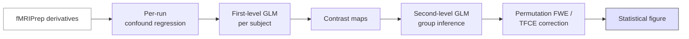

# Tutorial — fMRI first/second-level GLM

> From fMRIPrep derivatives to a group-level statistical map and a publication figure. ~2 hours.

## Prerequisites

- [Fundamentals → MRI sequences → EPI](../fundamentals/sequences/epi.md)
- [Analysis → Functional connectivity](../analysis/functional.md), [Group-level statistics](../analysis/group-stats.md), [Multiple comparisons](../analysis/multiple-comparisons.md)
- fMRIPrep derivatives for a task dataset.

## Pipeline overview



## 1. Get a working dataset

The easiest path: Nilearn ships a small task-fMRI dataset:

```python
from nilearn import datasets
ds = datasets.fetch_localizer_first_level()
print(ds.epi_img, ds.events)
```

Or use a real BIDS dataset you've already preprocessed with fMRIPrep. We'll show the BIDS path below.

## 2. First-level — one subject's GLM

```python
import pandas as pd
from nilearn.glm.first_level import FirstLevelModel
from nilearn import plotting

events = pd.read_csv("sub-01_task-checkerboard_events.tsv", sep="\t")
bold = "sub-01_task-checkerboard_desc-preproc_bold.nii.gz"
mask = "sub-01_task-checkerboard_desc-brain_mask.nii.gz"
confounds = pd.read_csv("sub-01_task-checkerboard_desc-confounds_timeseries.tsv",
                        sep="\t")
# Standard motion-only confound strategy
conf_cols = ["trans_x", "trans_y", "trans_z", "rot_x", "rot_y", "rot_z"]
confounds = confounds[conf_cols].fillna(0)

flm = FirstLevelModel(
    t_r=2.0,
    hrf_model="spm + derivative",
    drift_model="cosine",
    high_pass=0.01,
    mask_img=mask,
    minimize_memory=True,
)
flm = flm.fit(bold, events=events, confounds=confounds)
print(flm.design_matrices_[0].columns.tolist())
```

## 3. Build a contrast

```python
import numpy as np
design = flm.design_matrices_[0]

# A simple "task > baseline" contrast
conditions = ["checkerboard"]
contrast = np.zeros(design.shape[1])
for cond in conditions:
    contrast[design.columns.get_loc(cond)] = 1

z_map = flm.compute_contrast(contrast, output_type="z_score")
plotting.plot_stat_map(
    z_map, threshold=2.3, display_mode="z",
    cut_coords=[-20, -10, 0, 10, 20],
    title="Checkerboard > baseline (uncorrected z > 2.3)",
    output_file="figs/sub01_firstlevel.png",
)
```

## 4. Second-level — group inference

Repeat the first-level for every subject, collect the contrast maps, then:

```python
from nilearn.glm.second_level import SecondLevelModel

cmaps = [...]              # list of per-subject contrast .nii.gz
participants = pd.read_csv("participants.tsv", sep="\t")

# Simple one-sample t-test against zero
slm = SecondLevelModel().fit(cmaps,
                              design_matrix=pd.DataFrame({"intercept": [1]*len(cmaps)}))
group_z = slm.compute_contrast(second_level_contrast="intercept", output_type="z_score")
```

## 5. Multiple-comparisons correction — TFCE permutation

```python
from nilearn.glm.second_level import non_parametric_inference

corrected = non_parametric_inference(
    cmaps, design_matrix=pd.DataFrame({"intercept": [1]*len(cmaps)}),
    second_level_contrast="intercept",
    threshold=0.001,
    n_perm=1000,
    n_jobs=4,
    smoothing_fwhm=8,
)
# corrected["t"] is the t-map; corrected["logp_max_size"] is the cluster-corrected p
```

For a permutation-FWE alternative use FSL `randomise -T` via `nipype`, or PALM directly. See [Analysis → Multiple comparisons](../analysis/multiple-comparisons.md).

## 6. Publication figure

```python
fig = plotting.plot_glass_brain(
    group_z, threshold=3.1, display_mode="lzry", colorbar=True,
    title="Group main effect (FWE-corrected)",
    output_file="figs/group_glass.png",
    plot_abs=False,
)
```

For an "ortho" view with annotated coordinates use `plot_stat_map`. Save as `.pdf` + `.png`.

## Pitfalls

- **Confound strategy drift.** Use the *same* confounds across subjects.
- **Forgotten dummy TRs.** fMRIPrep already drops them when configured; check.
- **Wrong contrast vector.** Print `design.columns` before constructing the contrast.
- **Naïve uncorrected p < 0.05.** Always report the correction method explicitly.

## References

1. **Esteban O, Markiewicz CJ, Blair RW, et al.** fMRIPrep. *Nat Methods.* 2019;16:111-116. [doi:10.1038/s41592-018-0235-4](https://doi.org/10.1038/s41592-018-0235-4)
2. **Abraham A, Pedregosa F, Eickenberg M, et al.** Machine learning for neuroimaging with scikit-learn. *Front Neuroinform.* 2014;8:14. [doi:10.3389/fninf.2014.00014](https://doi.org/10.3389/fninf.2014.00014) — Nilearn.
3. **Smith SM, Nichols TE.** Threshold-free cluster enhancement. *NeuroImage.* 2009;44(1):83-98. [doi:10.1016/j.neuroimage.2008.03.061](https://doi.org/10.1016/j.neuroimage.2008.03.061)
