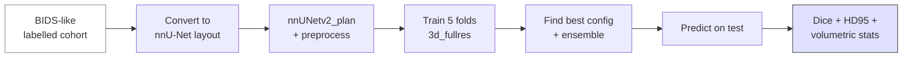

# Tutorial — Lesion segmentation with nnU-Net

> Train and evaluate a 3D segmentation network on a small public lesion dataset, with cross-site evaluation and proper metrics.

## Prerequisites

- [Fundamentals → Medical imaging → Segmentation](../fundamentals/medical-imaging/segmentation.md)
- [AI/ML → Deep learning for imaging](../ai/deep-learning.md)
- A GPU with ≥16 GB memory (A100, V100, RTX 3090/4090, etc.) for training.

## Pipeline overview



## 1. Pick a dataset

Two good public starting points:

- **ATLAS v2.0** (stroke lesions). [https://atlas.grand-challenge.org/](https://atlas.grand-challenge.org/)
- **WMH Segmentation Challenge**. [https://wmh.isi.uu.nl/](https://wmh.isi.uu.nl/)

Both ship as BIDS-like trees with `*_lesion.nii.gz` labels.

## 2. Convert to nnU-Net layout

```bash
export nnUNet_raw=$PWD/nnUNet_raw
export nnUNet_preprocessed=$PWD/nnUNet_preprocessed
export nnUNet_results=$PWD/nnUNet_results
mkdir -p $nnUNet_raw $nnUNet_preprocessed $nnUNet_results

# nnU-Net wants a specific folder shape per task. The official converter
# helpers are in nnUNetv2's dataset_conversion module.
python -c "
from nnunetv2.dataset_conversion.Dataset_ATLAS import convert
convert(source='/path/to/atlas', target_id=501)
"
```

Each "Dataset_*" converter script in `nnunetv2.dataset_conversion` handles a specific public dataset; copy one as a template for your own.

## 3. Plan + preprocess

```bash
nnUNetv2_plan_and_preprocess -d 501 --verify_dataset_integrity
```

nnU-Net fingerprints the dataset (resolution, dynamic range, class balance) and writes preprocessed `.npy` files + a plan file.

## 4. Train all five folds

```bash
for f in 0 1 2 3 4; do
  nnUNetv2_train 501 3d_fullres "$f" --npz
done
```

Each fold trains ~1000 epochs (default schedule). On a single A100 this is ~24 h per fold; you can parallelise across GPUs.

## 5. Find the best configuration + ensemble

```bash
nnUNetv2_find_best_configuration 501 -c 3d_fullres
```

This evaluates `3d_fullres` against `3d_lowres`, `2d`, and 5-fold ensembling; reports the best combination + the recommended post-processing.

## 6. Predict on a held-out test set

```bash
nnUNetv2_predict -i raw/imagesTs \
                 -o predictions/ \
                 -d 501 -c 3d_fullres -f 0 1 2 3 4 --save_probabilities
```

## 7. Evaluate properly

```python
import numpy as np, nibabel as nib
from pathlib import Path
from scipy.spatial.distance import directed_hausdorff

def dice(a, b):
    inter = np.sum(a & b)
    return 2 * inter / (a.sum() + b.sum() + 1e-9)

def hd95(a, b):
    # Simple HD95; real code uses the surface-points implementation
    a_pts = np.argwhere(a)
    b_pts = np.argwhere(b)
    d1 = np.sort([directed_hausdorff(a_pts, b_pts)[0] for _ in [None]])
    d2 = np.sort([directed_hausdorff(b_pts, a_pts)[0] for _ in [None]])
    return np.percentile(np.concatenate([d1, d2]), 95)

dices, hds = [], []
for pred_p in Path("predictions").glob("*.nii.gz"):
    gt_p = Path("labels") / pred_p.name
    pred = nib.load(pred_p).get_fdata().astype(bool)
    gt   = nib.load(gt_p).get_fdata().astype(bool)
    dices.append(dice(pred, gt))
    hds.append(hd95(pred, gt))

print(f"Dice: mean={np.mean(dices):.3f}, std={np.std(dices):.3f}")
print(f"HD95: mean={np.mean(hds):.2f} mm")
```

Report per-site + per-volume-range. Mean Dice hides failures on small lesions.

## 8. Cross-site evaluation

The honest test: train on Sites A+B+C, predict on Site D. Run nnU-Net's training on the source-site subset only, then predict on the target site. Expect a drop. If the drop is more than ~5 percentage points, your model has learned site, not pathology.

## Pitfalls

- **Class imbalance** — Dice-loss already helps; foreground-biased patch sampling helps more.
- **Sliding-window inference at the edges** — use overlap + Gaussian weighting; nnU-Net does this by default.
- **Overconfidence on small lesions** — they vanish in Dice averages; report sensitivity at fixed lesion-volume thresholds.
- **Training-serving mismatch** — pre-process the test data with the *exact* same plan as training.

## References

1. **Isensee F, Jaeger PF, Kohl SAA, Petersen J, Maier-Hein KH.** nnU-Net. *Nat Methods.* 2021;18:203-211. [doi:10.1038/s41592-020-01008-z](https://doi.org/10.1038/s41592-020-01008-z)
2. **Liew SL, Lo BP, Donnelly MR, et al.** A large, curated, open-source stroke neuroimaging dataset to improve lesion segmentation algorithms. *Sci Data.* 2022;9:320. [doi:10.1038/s41597-022-01401-7](https://doi.org/10.1038/s41597-022-01401-7) — ATLAS v2.0.
3. **Kuijf HJ, Biesbroek JM, de Bresser J, et al.** Standardized assessment of automatic segmentation of WMH; results of the WMH Segmentation Challenge. *IEEE Trans Med Imaging.* 2019;38(11):2556-2568. [doi:10.1109/TMI.2019.2905770](https://doi.org/10.1109/TMI.2019.2905770)
